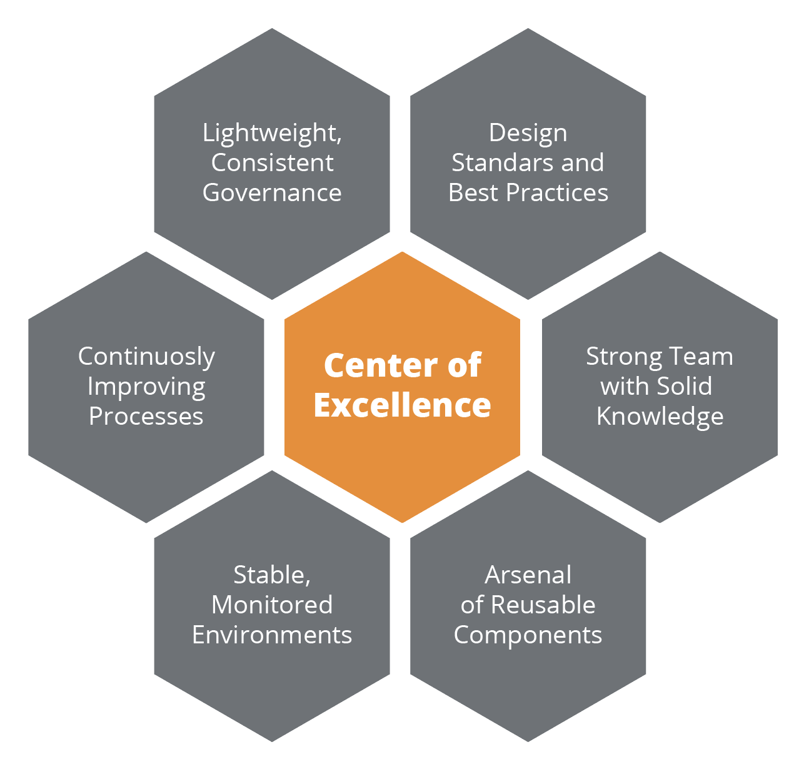

### Team Integration Approach for Days 30-60: Driving Consistency and Efficiency Across Teams

**Objective:**

To integrate the architecture team effectively into the organization by driving consistency and efficiency across teams. This involves enhancing team collaboration, standardizing processes, and ensuring alignment with organizational goals while fostering a culture of continuous improvement.

### Detailed Steps for Team Integration

#### 1. Standardize Processes and Best Practices

**a. Develop Standard Operating Procedures (SOPs):**
- **Create SOPs:**
  - Document and standardize development processes, coding standards, and architectural guidelines.
  - Ensure SOPs are easily accessible to all team members.

**b. Establish Best Practices:**
- **Define Best Practices:**
  - Identify and document best practices for software development, architecture design, and DevOps.
  - Regularly update best practices based on industry trends and feedback.

**c. Training and Workshops:**
- **Conduct Training:**
  - Organize training sessions and workshops to educate team members on SOPs and best practices.
  - Use real-world examples and case studies to illustrate key concepts.

### 2. Enhance Team Collaboration and Communication

**a. Cross-Functional Teams:**
- **Form Cross-Functional Teams:**
  - Establish cross-functional teams comprising members from development, operations, product management, and QA.
  - Clearly define roles and responsibilities within each team.

**b. Regular Communication:**
- **Set Up Meetings:**
  - Schedule regular meetings and stand-ups to ensure alignment and foster open communication.
  - Use tools such as Slack, Microsoft Teams, and Confluence to facilitate collaboration.

**c. Collaborative Tools:**
- **Implement Collaboration Tools:**
  - Use project management and collaboration tools like Jira, Trello, and Asana to track progress and manage tasks.
  - Encourage the use of shared documents and repositories for collaborative work.

### 3. Optimize Existing Systems for Consistency

**a. Performance Optimization:**
- **Conduct Reviews:**
  - Regularly review system performance to identify inconsistencies and areas for improvement.
  - Use monitoring tools like Prometheus and Grafana to gather data and track performance metrics.

**b. Address Technical Debt:**
- **Identify and Address Technical Debt:**
  - Continuously review the codebase to identify technical debt.
  - Develop a plan to address high-impact technical debt, ensuring it aligns with overall team goals.

**c. Consistent Environment Setup:**
- **Standardize Development Environments:**
  - Use tools like Docker and Kubernetes to create consistent development and testing environments.
  - Provide pre-configured development setups to reduce onboarding time and improve productivity.

### 4. Establish an Architecture Review Board (ARB)

**a. Define ARB Structure:**
- **Form the ARB:**
  - Establish an Architecture Review Board (ARB) composed of senior architects and key stakeholders.
  - Define the roles and responsibilities of ARB members.

**b. Set Governance Practices:**
- **Establish Governance:**
  - Develop governance practices to guide architectural decision-making and ensure alignment with organizational goals.
  - Implement a review process for significant architectural changes.

**c. Regular Reviews:**
- **Conduct Regular Reviews:**
  - Schedule regular ARB meetings to review and approve architectural decisions.
  - Ensure that all critical projects and architectural changes are reviewed by the ARB.

### 5. Adopt a Center of Excellence (CoE) Operating Model

**a. Define CoE Objectives:**
- **Set Objectives:**
  - Establish clear objectives for the Center of Excellence, focusing on driving innovation, standardization, and best practices across the organization.
  - Ensure that the CoE aligns with the overall strategic goals of the organization.

**b. Develop CoE Structure:**
- **Form the CoE:**
  - Create a dedicated CoE team comprising experienced architects, developers, and subject matter experts.
  - Define the roles and responsibilities of CoE members.

**c. Knowledge Sharing and Training:**
- **Promote Knowledge Sharing:**
  - Facilitate knowledge sharing and collaboration through workshops, training sessions, and knowledge repositories.
  - Develop a mentorship program to foster skill development and knowledge transfer.

**d. Innovation and Best Practices:**
- **Drive Innovation:**
  - Encourage experimentation and adoption of new technologies and methodologies.
  - Establish best practices and guidelines for the organization to follow.

**e. Continuous Improvement:**
- **Monitor and Improve:**
  - Regularly assess the effectiveness of CoE initiatives and make necessary adjustments.
  - Gather feedback from team members and stakeholders to drive continuous improvement.

### 6. Foster a Culture of Continuous Improvement

**a. Feedback and Retrospectives:**
- **Conduct Retrospectives:**
  - Hold regular retrospectives to gather feedback and identify areas for improvement.
  - Encourage open and constructive feedback from all team members.

**b. Continuous Learning:**
- **Promote Learning and Development:**
  - Provide opportunities for continuous learning through training programs, certifications, and conferences.
  - Encourage team members to stay updated with the latest industry trends and technologies.

**c. Agile Methodologies:**
- **Adopt Agile Practices:**
  - Implement agile methodologies such as Scrum or Kanban to manage workflows and ensure adaptability.
  - Conduct regular sprints and planning sessions to keep the team focused and aligned.

### 7. Monitoring and Adjustments

**a. Track Progress:**
- **Use Metrics and KPIs:**
  - Define and track key performance indicators (KPIs) to measure team performance and process efficiency.
  - Regularly review progress against these metrics to ensure continuous improvement.

**b. Continuous Feedback:**
- **Gather Feedback:**
  - Continuously gather feedback from team members and stakeholders to identify areas for improvement.
  - Use this feedback to make necessary adjustments to processes and practices.

**c. Regular Check-Ins:**
- **Conduct Check-Ins:**
  - Schedule regular check-ins to discuss progress, address any issues, and ensure alignment with goals.
  - Use these sessions to reinforce best practices and SOPs.

### Conclusion

By focusing on driving consistency and efficiency across teams, the architecture team can enhance collaboration, standardize processes, and ensure alignment with organizational goals. Establishing an Architecture Review Board and adopting a Center of Excellence operating model will further strengthen governance and drive innovation. This structured approach will foster a culture of continuous improvement, driving overall team performance and productivity. Continuous monitoring and adjustments will ensure that the team remains agile and responsive to changing business needs.
