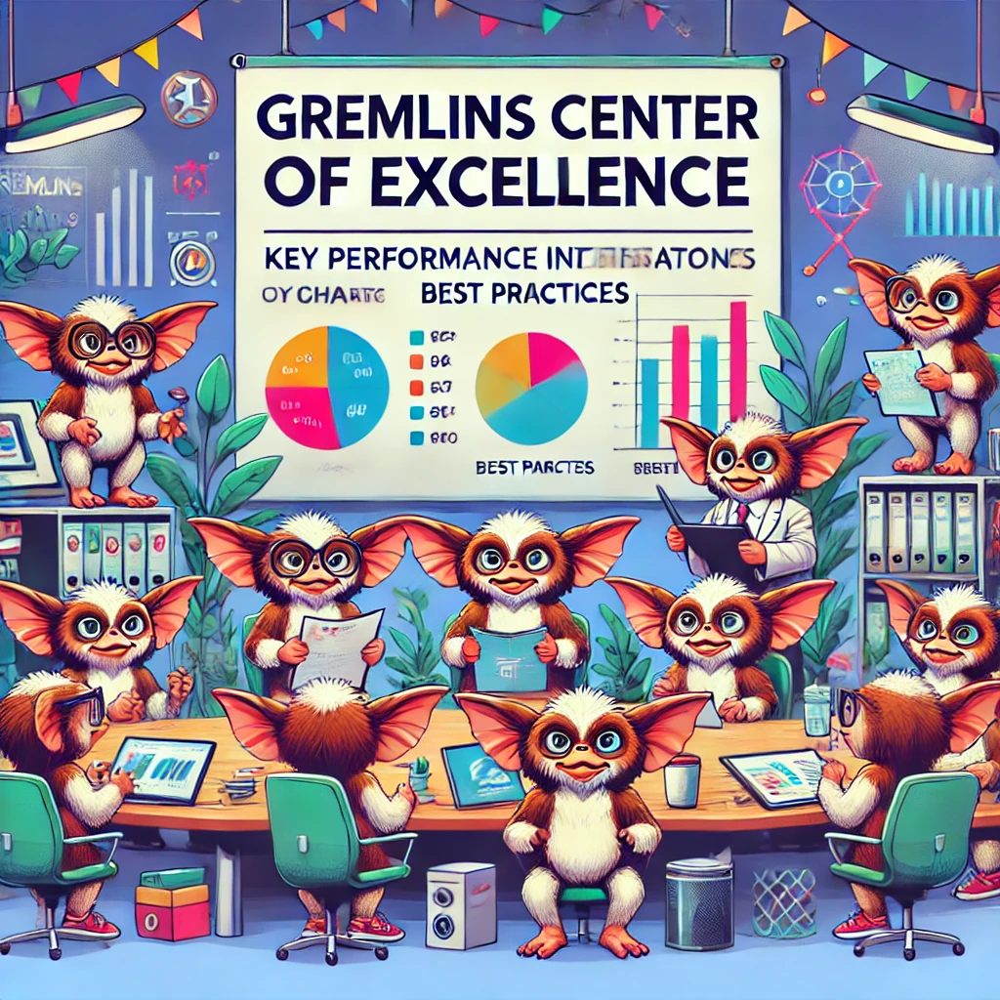

**Objective:**

To establish an Architecture Center of Excellence (CoE) at Gremlins Inc. that provides centralized control over architectural standards and governance while enabling decentralized execution by various teams to foster innovation and agility.

### Key Components of the Architecture CoE Operating Model

1. **Centralized Governance and Standards**
2. **Decentralized Execution and Autonomy**
3. **Knowledge Sharing and Collaboration**
4. **Continuous Improvement and Innovation**

### Detailed Plan for Setting Up the Architecture CoE

#### 1. Centralized Governance and Standards

**a. Establish the Architecture Review Board (ARB):**
- **Role of the ARB:**
  - The ARB will oversee architectural decisions, ensure alignment with organizational goals, and enforce standards.
  - Members will include senior architects, technical leads, and key stakeholders from various departments.
- **Governance Practices:**
  - Develop governance practices to guide architectural decision-making.
  - Implement a review and approval process for significant architectural changes and new initiatives.

**b. Define and Document Standards:**
- **Architectural Standards:**
  - Define architectural standards, principles, and best practices that align with the company’s strategic goals.
- **Documentation:**
  - Create comprehensive documentation for architectural guidelines, coding standards, and technology stacks.
  - Ensure documentation is easily accessible to all teams through a centralized repository.

**c. Develop Policies and Procedures:**
- **Standard Operating Procedures (SOPs):**
  - Develop SOPs for critical processes such as design reviews, technology evaluations, and change management.
- **Compliance and Audits:**
  - Implement regular compliance checks and audits to ensure adherence to established standards and practices.

#### 2. Decentralized Execution and Autonomy

**a. Empower Cross-Functional Teams:**
- **Form Cross-Functional Teams:**
  - Establish cross-functional teams consisting of members from development, operations, product management, and QA.
  - Clearly define roles and responsibilities within each team to ensure effective collaboration and execution.
- **Delegated Authority:**
  - Delegate authority to cross-functional teams to make day-to-day architectural decisions within the framework of established standards.

**b. Enable Agile Methodologies:**
- **Adopt Agile Practices:**
  - Encourage the use of agile methodologies such as Scrum or Kanban to manage projects and workflows.
  - Conduct regular sprints, retrospectives, and planning sessions to keep teams focused and aligned.
- **Support Autonomy:**
  - Allow teams the flexibility to adapt processes and practices to best meet their specific needs and project requirements.

**c. Provide Tools and Resources:**
- **Development and Collaboration Tools:**
  - Provide teams with the necessary tools for development, collaboration, and project management (e.g., Jira, Confluence, Slack).
- **Training and Development:**
  - Offer continuous learning opportunities through training programs, certifications, and workshops to enhance team capabilities.

#### 3. Knowledge Sharing and Collaboration

**a. Foster a Knowledge-Sharing Culture:**
- **Knowledge Repositories:**
  - Create centralized knowledge repositories for sharing best practices, case studies, and technical documentation.
- **Internal Communities:**
  - Establish internal communities of practice (CoPs) where team members can share knowledge, discuss challenges, and collaborate on solutions.

**b. Regular Communication:**
- **Scheduled Meetings:**
  - Schedule regular meetings, workshops, and webinars to facilitate knowledge sharing and collaboration across teams.
- **Communication Channels:**
  - Use collaboration tools such as Microsoft Teams, Slack, and email newsletters to keep teams informed and engaged.

#### 4. Continuous Improvement and Innovation

**a. Promote Innovation:**
- **Innovation Labs:**
  - Set up innovation labs where teams can experiment with new technologies and approaches without the constraints of day-to-day project pressures.
- **Hackathons and Competitions:**
  - Organize hackathons and competitions to encourage creative problem-solving and innovation.

**b. Continuous Feedback and Improvement:**
- **Retrospectives and Feedback Loops:**
  - Conduct regular retrospectives and feedback sessions to identify areas for improvement and gather insights from team members.
- **Iterative Improvement:**
  - Use feedback to continuously refine and improve architectural practices, standards, and processes.

### Implementation Roadmap

**Phase 1: Planning and Setup (0-3 months)**
- Establish the Architecture Review Board (ARB).
- Define and document architectural standards and governance practices.
- Set up knowledge repositories and communication channels.

**Phase 2: Empowerment and Execution (3-6 months)**
- Form cross-functional teams and delegate authority for decentralized execution.
- Provide necessary tools and resources to teams.
- Start implementing agile methodologies.

**Phase 3: Knowledge Sharing and Collaboration (6-12 months)**
- Foster a culture of knowledge sharing through CoPs, regular meetings, and collaboration tools.
- Organize training sessions, workshops, and webinars.

**Phase 4: Continuous Improvement and Innovation (12-24 months)**
- Promote innovation through labs, hackathons, and competitions.
- Conduct regular retrospectives and feedback sessions to drive continuous improvement.

### Conclusion

By establishing an Architecture Center of Excellence (CoE) at Gremlins Inc. with centralized control over standards and governance and decentralized execution, we can drive consistency and efficiency across teams. This model will enhance collaboration, foster innovation, and ensure alignment with organizational goals. Continuous monitoring and iterative improvement will keep the architecture team agile and responsive to the evolving business landscape.
