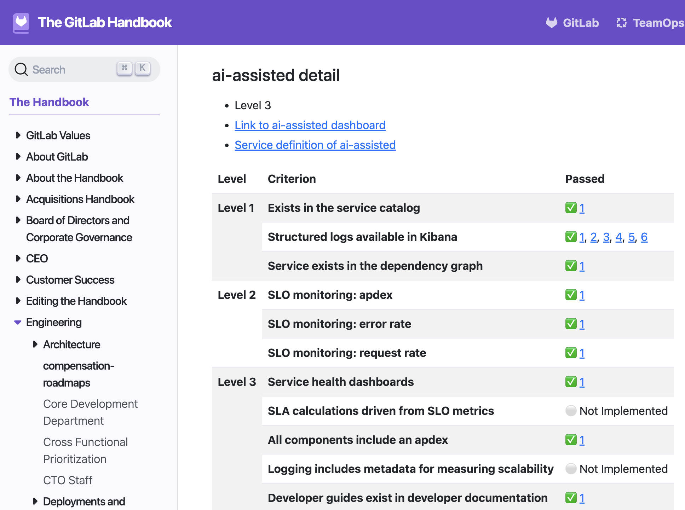

### Implementing a Tech Maturity Model

**Objective:**

To enhance the technology landscape at Gremlins Inc. by introducing a Tech Maturity Model. This will help assess and improve the maturity of services.

#### 1. Define the Tech Maturity Model

**a. Framework Selection:**
- **Reference Example:**
  - Use GitLab's Service Maturity Model as a reference framework.
- **Customization:**
  - Customize the framework to fit Gremlins Inc.'s specific needs and organizational context.

**b. Key Components:**
- **Maturity Levels:**
  - Define maturity levels (e.g., Initial, Managed, Defined, Quantitatively Managed, Optimizing).
- **Assessment Criteria:**
  - Establish criteria for each maturity level, covering aspects like documentation, monitoring, scalability, security, and resilience.

#### 2. Develop the Maturity Model

**a. Criteria Development:**
- **Categories:**
  - Create detailed criteria for each category (e.g., Infrastructure, Application Development, Security, Operations).
- **Scoring System:**
  - Develop a scoring system to assess the maturity level of each service.

**b. Documentation:**
- **Guidelines:**
  - Provide comprehensive guidelines and examples for each maturity level and criteria.
- **Templates:**
  - Create templates for assessment reports and improvement plans.

#### 3. Conduct Initial Assessments

**a. Pilot Assessment:**
- **Select Services:**
  - Choose a few services to pilot the maturity assessment process.
- **Assessment Execution:**
  - Conduct assessments using the defined criteria and scoring system.

**b. Report and Feedback:**
- **Results:**
  - Document the results of the assessments.
- **Feedback Loop:**
  - Gather feedback from the teams involved to refine the process.

#### 4. Continuous Improvement

**a. Regular Assessments:**
- **Schedule:**
  - Establish a regular schedule for maturity assessments (e.g., quarterly or bi-annually).
- **Tracking:**
  - Track progress and improvements over time.

**b. Improvement Plans:**
- **Action Plans:**
  - Develop action plans to address areas of improvement identified in the assessments.
- **Resource Allocation:**
  - Allocate resources and support for implementing improvement plans.

#### Example Maturity Matrix

**Diagram: Example Maturity Matrix**

| Category             | Initial | Managed | Defined | Quantitatively Managed | Optimizing |
|----------------------|---------|---------|---------|------------------------|------------|
| Documentation        | None    | Basic   | Standardized | Metrics Tracked       | Continuously Improved |
| Monitoring           | None    | Ad-hoc  | Standard Tools | Automated Alerts     | Predictive Analysis  |
| Scalability          | Limited | Moderate| Planned | Stress Tested          | Auto-Scaling          |
| Security             | Basic   | Improved| Policies Defined | Regular Audits       | Proactive Threat Detection |
| Resilience           | Reactive| Basic   | Defined SLAs | Performance Metrics   | Continuous Resilience Testing |

### Conclusion
Implementing a Tech Maturity Model at Gremlins Inc. will provide a structured approach to assessing and improving the maturity of services. By defining clear frameworks, establishing governance, and fostering a culture of continuous improvement, Gremlins Inc. can ensure that its technology landscape remains competitive and aligned with business goals. Regular assessments and updates will help track progress and drive long-term benefits for the organization.