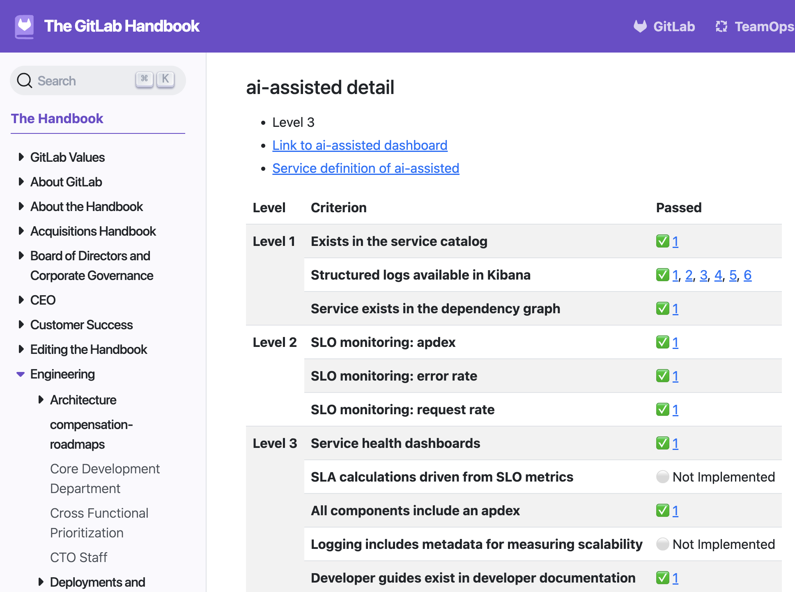
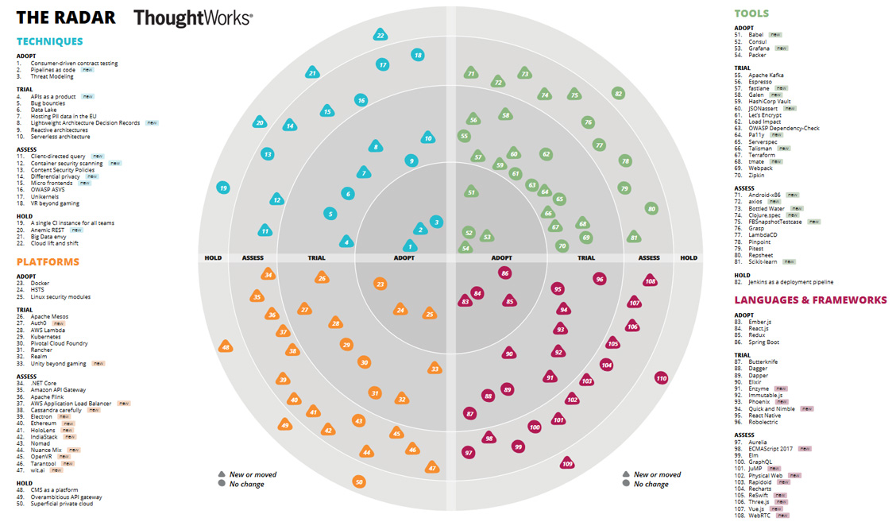

### Innovation at Gremlins Inc.: 
### Implementing a Tech Maturity Model and Tech Radar

**Objective:**

To enhance the technology landscape at Gremlins Inc. by introducing a Tech Maturity Model and a Tech Radar. These tools will help assess and improve the maturity of services and provide a structured approach to evaluating and adopting new technologies.

### Implementing a Tech Maturity Model

#### 1. Define the Tech Maturity Model

**a. Framework Selection:**
- **Reference Example:**
  - Use GitLab's Service Maturity Model as a reference framework.
- **Customization:**
  - Customize the framework to fit Gremlins Inc.'s specific needs and organizational context.

**b. Key Components:**
- **Maturity Levels:**
  - Define maturity levels (e.g., Initial, Managed, Defined, Quantitatively Managed, Optimizing).
- **Assessment Criteria:**
  - Establish criteria for each maturity level, covering aspects like documentation, monitoring, scalability, security, and resilience.

#### 2. Develop the Maturity Model

**a. Criteria Development:**
- **Categories:**
  - Create detailed criteria for each category (e.g., Infrastructure, Application Development, Security, Operations).
- **Scoring System:**
  - Develop a scoring system to assess the maturity level of each service.

**b. Documentation:**
- **Guidelines:**
  - Provide comprehensive guidelines and examples for each maturity level and criteria.
- **Templates:**
  - Create templates for assessment reports and improvement plans.

#### 3. Conduct Initial Assessments

**a. Pilot Assessment:**
- **Select Services:**
  - Choose a few services to pilot the maturity assessment process.
- **Assessment Execution:**
  - Conduct assessments using the defined criteria and scoring system.

**b. Report and Feedback:**
- **Results:**
  - Document the results of the assessments.
- **Feedback Loop:**
  - Gather feedback from the teams involved to refine the process.

#### 4. Continuous Improvement

**a. Regular Assessments:**
- **Schedule:**
  - Establish a regular schedule for maturity assessments (e.g., quarterly or bi-annually).
- **Tracking:**
  - Track progress and improvements over time.

**b. Improvement Plans:**
- **Action Plans:**
  - Develop action plans to address areas of improvement identified in the assessments.
- **Resource Allocation:**
  - Allocate resources and support for implementing improvement plans.

#### Example Maturity Matrix

**Diagram: Example Maturity Matrix**

| Category             | Initial | Managed | Defined | Quantitatively Managed | Optimizing |
|----------------------|---------|---------|---------|------------------------|------------|
| Documentation        | None    | Basic   | Standardized | Metrics Tracked       | Continuously Improved |
| Monitoring           | None    | Ad-hoc  | Standard Tools | Automated Alerts     | Predictive Analysis  |
| Scalability          | Limited | Moderate| Planned | Stress Tested          | Auto-Scaling          |
| Security             | Basic   | Improved| Policies Defined | Regular Audits       | Proactive Threat Detection |
| Resilience           | Reactive| Basic   | Defined SLAs | Performance Metrics   | Continuous Resilience Testing |

### Implementing a Tech Radar

#### 1. Establish the Tech Radar Framework

**a. Define Quadrants:**
- **Categories:**
  - Define quadrants/categories for the Tech Radar (e.g., Techniques, Tools, Platforms, Languages & Frameworks).

**b. Define Rings:**
- **Adoption Stages:**
  - Establish rings to represent different stages of adoption (e.g., Adopt, Trial, Assess, Hold).

#### 2. Create the Tech Radar Process

**a. Technology Identification:**
- **Sources:**
  - Gather input from internal teams, industry reports, and research to identify relevant technologies.
- **Submission Process:**
  - Implement a process for team members to submit technologies for consideration.

**b. Evaluation Criteria:**
- **Assessment:**
  - Define criteria for evaluating technologies, including factors like business impact, technical feasibility, and risk.

#### 3. Populate the Tech Radar

**a. Initial Population:**
- **Current Technologies:**
  - Populate the Tech Radar with technologies currently in use at Gremlins Inc.
- **New Technologies:**
  - Add promising new technologies identified through the evaluation process.

**b. Regular Updates:**
- **Review Cycle:**
  - Establish a regular review cycle (e.g., quarterly) to update the Tech Radar.
- **Feedback Loop:**
  - Gather feedback from teams to continuously refine the radar.

#### Example Tech Radar

**Diagram: Example Tech Radar**

**Quadrants:**
- Techniques
- Tools
- Platforms
- Languages & Frameworks

**Rings:**
- Adopt
- Trial
- Assess
- Hold

| Quadrant              | Adopt                                  | Trial                                | Assess                               | Hold                                  |
|-----------------------|----------------------------------------|--------------------------------------|--------------------------------------|---------------------------------------|
| Techniques            | Continuous Integration (CI)            | Test-Driven Development (TDD)        | Pair Programming                     | Waterfall Development                 |
| Tools                 | Docker                                 | Kubernetes                           | Prometheus                           | Jenkins (without Docker integration)  |
| Platforms             | AWS Lambda                             | Google Cloud Functions               | Azure Kubernetes Service (AKS)       | On-premise data centers               |
| Languages & Frameworks| Python                                 | Rust                                 | Go                                   | Perl                                  |

### Process and Framework

#### 1. Governance and Management

**a. Steering Committee:**
- **Formation:**
  - Establish a steering committee to oversee the Tech Maturity Model and Tech Radar initiatives.
- **Responsibilities:**
  - Define responsibilities, including reviewing assessments, approving technologies for the radar, and prioritizing improvement plans.

**b. Roles and Responsibilities:**
- **Owners:**
  - Assign owners for each service or technology to ensure accountability.
- **Facilitators:**
  - Designate facilitators to manage the assessment and radar update processes.

#### 2. Communication and Training

**a. Communication Plan:**
- **Stakeholder Engagement:**
  - Develop a communication plan to keep stakeholders informed about the maturity model and tech radar initiatives.
- **Regular Updates:**
  - Provide regular updates through meetings, newsletters, and dashboards.

**b. Training Programs:**
- **Workshops:**
  - Conduct workshops to train teams on the Tech Maturity Model and Tech Radar processes.
- **Resources:**
  - Provide resources and documentation to support ongoing learning and adoption.

### Conclusion

Implementing a Tech Maturity Model and Tech Radar at Gremlins Inc. will provide a structured approach to assessing and improving the maturity of services while identifying and adopting new technologies. By defining clear frameworks, establishing governance, and fostering a culture of continuous improvement, Gremlins Inc. can ensure that its technology landscape remains competitive and aligned with business goals. Regular assessments and updates will help track progress and drive long-term benefits for the organization.
