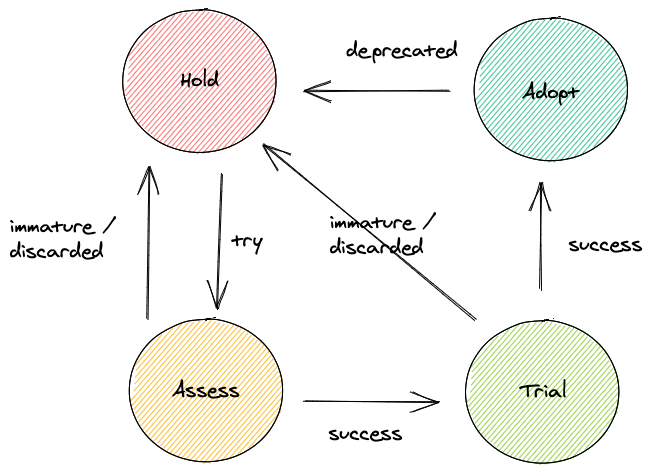

### Implementing a Tech Radar

**Objective:**

To enhance the technology landscape at Gremlins Inc. by introducing a Tech Radar. This will help provide a structured approach to evaluating and adopting new technologies.

### Establish the Tech Radar Framework

One of the Tech Radar's purposes is to find the right balance between fast technology adoption and thorough assessment. There is a cost of opportunity when not adopting new, better ways to build software systems; however, choosing the wrong technology can be costly.

The Tech Radar process defines a shortlist of stages (i.e., rings) that technology has to pass through in its way to be fully onboarded and available to HUB engineers. This document outlines those states and what inputs, outputs, activities, and criteria should be considered to move through the process towards a successful ending.

For the rest of this document, we will use the term "Blip" to refer to any given technology (e.g., language, framework, tool, platform or technique) that appears on the radar.

#### Stages (a.k.a. Rings)

Stages or Rings codify information about a given blip from multiple perspectives:
Whether the Architecture team has already spent time assessing it or not
How mature is the technology behind this blip (e.g., recently launched beta)
How well understood it is inside HUB (e.g., staff with production experience)
Is there any HUB system using it in production already?
What stage or ring a blip falls in has multiple consequences, the most important one being whether engineers across the development teams can freely use it for their production use cases or not.

#### Ring 1 - Hold

Hold contains blips that HUB is not ready to adopt yet, for various reasons. We can break down these reasons into four categories:
New (no assessment has been done yet)
Immature (technology not ready yet for adoption)
Discarded (assessed and concluded that we will not adopt)
Deprecated (once adopted technology, replaced by a better alternative)
New projects cannot use blips in this category either because they are unknown and unproven or trying to eliminate them from HUB technical stack.

#### Ring 2 - Assess

Blips move to Assess once the assessment process has started. The assessment's output is varied (e.g., PoC, documentation), but it should always include a broader audience presentation (e.g., Guilds, Architecture team).

New projects still cannot use blips in this category.

#### Moving to 'Trial'

If the blip assessment is successful, the following steps are:
Identify a business use case where this technology would help
Allocate resources and draft a plan for the Trial phase
A blip mustn't move to 'Trial' until there is a plan to move it from a conceptual assessment to an actual, productionised usage.

#### Moving to 'Hold'

Not all assessments are successful. A blip moves back to 'Hold' under the following circumstances (previously mentioned in the 'Hold' section):
Immature: the technology might have shown potential, but it is not ready to meet our production systems' quality standards. Consider reassessing in the future.
Discarded: something intrinsic to the technology has deemed it not suitable for HUB needs and standards. The decision is permanent.
When an assessment result is negative, it is crucial to make it very clear why. Otherwise, future HUB generations might waste time reassessing something that is not worth the effort.

#### Ring 3 - Trial

The 'Trial' stage is where expectations meet reality. Building a first, production-ready use case with a given blip is the ultimate test to guarantee we understand the technology and know how to use it.

During the 'Trial' stage, the team driving it is responsible for several tasks:
Gather public documentation and reference links to ease the learning curve of subsequent adopters
Produce collateral where something is not publicly available (e.g., document unexpected behaviours)
Share successes/failures with the broader team to raise awareness of the works and its results
Put forward an adoption recommendation to the Architecture team

Generally, new projects still cannot use blips in this category. However, for technologies that are considered "no-brainers", it should be possible to make exceptions and allow multiple teams to move forward with them.

**Moving to 'Adopt'**

Ultimately, the Architecture team will decide whether to move the blip to Adopt or not upon consulting with all relevant parties.

**Moving to 'Hold'**

A blip may move back to 'Hold' if the trial is not successful. Similar to the 'Assess' stage, the reasons should be documented for future reference.

#### Ring 4 - Adopt

The final stage contains blips that HUB trust and has enough development and operational experience to run in production.

Teams can choose technologies in this ring without questions being asked, provided they are the right tool for the job.

We should regularly review blips in this ring to make sure they are still the best option to solve the problem at hand or start the search for better alternatives otherwise. If that were the case, the blip would move to 'Hold' as deprecated.

--- 
#### Example

**Quadrants:**
- Techniques
- Tools
- Platforms
- Languages & Frameworks

**Rings:**
- Adopt
- Trial
- Assess
- Hold

| Quadrant              | Adopt                                  | Trial                                | Assess                               | Hold                                  |
|-----------------------|----------------------------------------|--------------------------------------|--------------------------------------|---------------------------------------|
| Techniques            | Continuous Integration (CI)            | Test-Driven Development (TDD)        | Pair Programming                     | Waterfall Development                 |
| Tools                 | Docker                                 | Kubernetes                           | Prometheus                           | Jenkins (without Docker integration)  |
| Platforms             | AWS Lambda                             | Google Cloud Functions               | Azure Kubernetes Service (AKS)       | On-premise data centers               |
| Languages & Frameworks| Python                                 | Rust                                 | Go                                   | Perl                                  |

---

### Process and Framework

#### 1. Governance and Management

**a. Steering Committee:**
- **Formation:**
  - Establish a steering committee to oversee the Tech Maturity Model and Tech Radar initiatives.
- **Responsibilities:**
  - Define responsibilities, including reviewing assessments, approving technologies for the radar, and prioritizing improvement plans.

**b. Roles and Responsibilities:**
- **Owners:**
  - Assign owners for each service or technology to ensure accountability.
- **Facilitators:**
  - Designate facilitators to manage the assessment and radar update processes.

#### 2. Communication and Training

**a. Communication Plan:**
- **Stakeholder Engagement:**
  - Develop a communication plan to keep stakeholders informed about the maturity model and tech radar initiatives.
- **Regular Updates:**
  - Provide regular updates through meetings, newsletters, and dashboards.

**b. Training Programs:**
- **Workshops:**
  - Conduct workshops to train teams on the Tech Maturity Model and Tech Radar processes.
- **Resources:**
  - Provide resources and documentation to support ongoing learning and adoption.

### Conclusion

Implementing a Tech Radar at Gremlins Inc. will provide a structured approach to identifying and adopting new technologies. By defining clear frameworks, establishing governance, and fostering a culture of continuous improvement, Gremlins Inc. can ensure that its technology landscape remains competitive and aligned with business goals. Regular assessments and updates will help track progress and drive long-term benefits for the organization.
