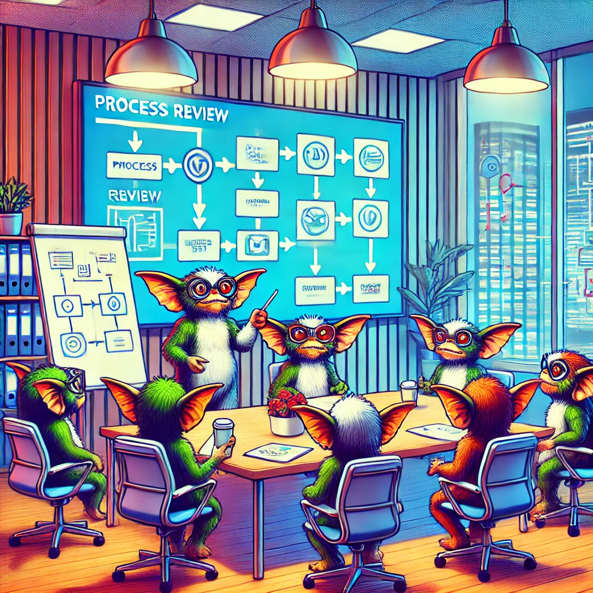

### Sample Process Review and Refinement for Gremlins Inc.

**Objective:**

To ensure consistency across teams and identify efficiency improvements within the processes at Gremlins Inc.

### 1. Conduct a Comprehensive Review

#### a. Gather Information

**Stakeholder Interviews:**
- Conduct interviews with team members, project managers, and stakeholders to gather insights into current workflows and processes.
- Questions to ask:
  - What are the most time-consuming tasks in your workflow?
  - Where do you see the most frequent delays or bottlenecks?
  - What tools and processes are you currently using?

**Process Mapping:**
- Create detailed process maps of existing workflows to visualize the current state and identify bottlenecks or inefficiencies.
- Example tools: Lucidchart, Miro.

#### b. Analyze Data

**Performance Metrics:**
- Review existing performance metrics and historical data to identify trends and areas for improvement.
- Metrics to consider:
  - Average time to complete tasks.
  - Frequency of errors or defects.
  - Utilization rates of tools and resources.

**Feedback Analysis:**
- Analyze feedback from team members and stakeholders to pinpoint specific pain points and inefficiencies in current processes.

### 2. Identify Areas for Improvement

#### a. Bottleneck Identification

**Critical Path Analysis:**
- Identify bottlenecks and delays in the current workflows that hinder productivity.
- Use tools like Microsoft Project or Asana to map out critical paths and dependencies.

**Root Cause Analysis:**
- Perform root cause analysis to understand the underlying issues causing these bottlenecks.
- Techniques: Fishbone diagram, 5 Whys.

#### b. Benchmarking

**Industry Best Practices:**
- Research industry best practices and benchmarks to identify potential improvements that can be applied to the architecture team’s processes.
- Sources: Industry reports, case studies, expert consultations.

**Internal Comparison:**
- Compare the performance of different teams or projects within the organization to identify best practices already in use.

### 3. Redesign Workflows

#### a. Process Optimization

**Lean Principles:**
- Apply Lean principles to eliminate waste and streamline workflows.
- Examples:
  - Reduce handoffs between teams.
  - Simplify approval processes.

**Automation:**
- Identify opportunities to automate repetitive tasks and processes to improve efficiency.
- Tools: Jenkins for CI/CD, Ansible for configuration management.

#### b. Workflow Redesign

**Standardization:**
- Standardize processes across teams to ensure consistency and reduce variability.
- Develop SOPs (Standard Operating Procedures) for key processes.

**Agile Methodologies:**
- Incorporate Agile methodologies such as Scrum or Kanban to enhance flexibility and responsiveness.
- Tools: Jira, Trello.

### 4. Introduce or Refine Metrics and KPIs

#### a. Define Relevant KPIs

**Performance Metrics:**
- Define Key Performance Indicators (KPIs) that align with the organization’s strategic goals and provide measurable outcomes for the architecture team.
- Examples:
  - Code quality (defect density).
  - System performance (response time).
  - Deployment frequency.
  - Team productivity (velocity).

#### b. Implement Monitoring Tools

**Dashboards:**
- Set up dashboards using tools like Grafana or Power BI to visualize KPIs and track progress in real-time.

**Automated Reporting:**
- Implement automated reporting systems to regularly update stakeholders on performance metrics and KPIs.

### 5. Establish a Continuous Improvement Framework

#### a. Regular Reviews

**Retrospectives:**
- Conduct regular retrospectives to review what’s working well and what needs improvement.
- Format: Structured meetings with clear action items.

**Feedback Sessions:**
- Hold feedback sessions with team members to gather input on the effectiveness of new workflows and processes.

#### b. Iterative Refinement

**Plan-Do-Check-Act (PDCA) Cycle:**
- Implement the PDCA cycle for continuous improvement. Plan changes, implement them (Do), check the results, and act on findings to refine the process further.

### Implementation and Monitoring

#### a. Implementation Plan

**Phased Rollout:**
- Roll out process improvements in phases to manage change effectively and minimize disruption.

**Training:**
- Provide training to team members on new workflows and tools to ensure smooth adoption.

#### b. Monitor and Adjust

**Performance Tracking:**
- Continuously monitor performance metrics and KPIs to track the impact of process improvements.

**Adjustments:**
- Make necessary adjustments based on ongoing feedback and performance data to ensure continuous optimization.

### Conclusion

By conducting a comprehensive review and refinement of workflows and processes, Gremlins Inc. can ensure consistency across teams and identify efficiency improvements. Implementing best practices and continuous improvement frameworks will drive optimal performance and alignment with organizational goals. This structured approach will enhance team productivity and overall efficiency.
