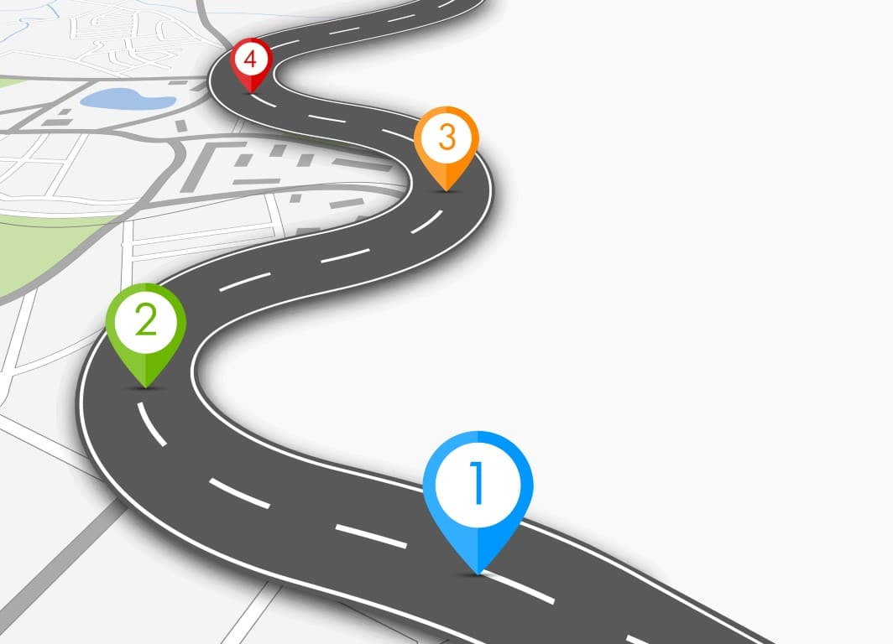

### Developing a Detailed Roadmap for Strategic Alignment and Long-Term Vision

**Objective:**

To create a detailed roadmap for strategic alignment and long-term vision that guides the architect team towards achieving its goals, ensuring that the roadmap aligns with the overall business objectives and technological advancements.

### Steps to Develop the Roadmap

#### 1. Initial Assessment and Alignment

**a. Understand Business Objectives:**
- **Meet with Stakeholders:**
  - Conduct meetings with key stakeholders (e.g., executives, product managers, business analysts) to understand the overall business objectives and priorities.
- **Review Strategic Documents:**
  - Review existing strategic documents, business plans, and market analysis reports to align the technology roadmap with business goals.

**b. Assess Current State:**
- **Current Architecture Review:**
  - Assess the current architecture, technology stack, processes, and workflows to understand the existing state and identify areas for improvement.
- **SWOT Analysis:**
  - Conduct a SWOT (Strengths, Weaknesses, Opportunities, Threats) analysis to identify internal and external factors affecting the architecture and technology strategy.

#### 2. Define Vision and Objectives

**a. Vision Statement:**
- **Create a Vision Statement:**
  - Develop a clear and concise vision statement that reflects the desired future state of the architecture and technology landscape at Gremlins Inc.

**b. Strategic Objectives:**
- **Set Objectives:**
  - Define specific, measurable, achievable, relevant, and time-bound (SMART) objectives that support the vision.
- **Key Results:**
  - Establish key results that will be used to measure the progress and success of each objective.

#### 3. Identify Key Initiatives and Projects

**a. Key Initiatives:**
- **Innovation and Improvement Initiatives:**
  - Identify initiatives focused on innovation, process improvement, and technology upgrades that align with the strategic objectives.
- **Risk Mitigation Initiatives:**
  - Identify initiatives aimed at mitigating risks identified during the SWOT analysis.

**b. Prioritize Projects:**
- **Prioritization Framework:**
  - Develop a prioritization framework based on criteria such as business impact, feasibility, resource availability, and alignment with strategic objectives.
- **Project Roadmap:**
  - Create a high-level project roadmap that outlines the sequence and timeline of key initiatives and projects.

#### 4. Develop Detailed Roadmap

**a. Phases and Milestones:**
- **Phased Approach:**
  - Break down the roadmap into phases, each with specific milestones and deliverables.
- **Milestone Definition:**
  - Define clear milestones for each phase to track progress and ensure alignment with the overall strategy.

**b. Resource Allocation:**
- **Resource Planning:**
  - Identify the resources (e.g., personnel, budget, tools) required for each phase and project.
- **Capacity Planning:**
  - Conduct capacity planning to ensure that the team has the necessary bandwidth to execute the roadmap.

**c. Risk Management:**
- **Risk Identification:**
  - Identify potential risks and challenges associated with the roadmap.
- **Mitigation Plans:**
  - Develop mitigation plans to address identified risks and ensure project continuity.

### Roadmap Coverage

**1. Current State Analysis:**
   - Overview of the current architecture, technology stack, processes, and workflows.
   - Results of the SWOT analysis.

**2. Vision and Objectives:**
   - Vision statement for the architecture and technology landscape.
   - Strategic objectives and key results.

**3. Key Initiatives and Projects:**
   - List of key initiatives and projects aligned with the strategic objectives.
   - Prioritization framework and project roadmap.

**4. Phases and Milestones:**
   - Detailed phases of the roadmap, each with specific milestones and deliverables.
   - Timeline for each phase.

**5. Resource Allocation:**
   - Resource requirements and capacity planning for each phase and project.
   - Budget allocation and personnel assignment.

**6. Risk Management:**
   - Identified risks and challenges.
   - Mitigation plans and contingency strategies.

**7. Monitoring and Review:**
   - Metrics and KPIs to measure progress and success.
   - Review and feedback mechanisms for continuous improvement.

### Implementation and Review

**a. Implementation Plan:**
- **Execution Plan:**
  - Develop a detailed execution plan for each phase and project, including tasks, responsibilities, and timelines.
- **Communication Plan:**
  - Create a communication plan to keep stakeholders informed about progress, changes, and key milestones.

**b. Continuous Monitoring:**
- **Progress Tracking:**
  - Use project management tools to track progress against the roadmap and milestones.
- **Regular Reviews:**
  - Conduct regular reviews and update the roadmap based on feedback, changing business priorities, and new opportunities.

**c. Feedback and Improvement:**
- **Feedback Loop:**
  - Establish a feedback loop with stakeholders to gather input and make iterative improvements to the roadmap.
- **Continuous Improvement:**
  - Use lessons learned from each phase to improve processes, methodologies, and future planning.

By following these steps, Gremlins Inc. can develop a detailed and actionable roadmap that aligns with strategic objectives, drives long-term vision, and ensures continuous improvement in the architecture and technology landscape.
