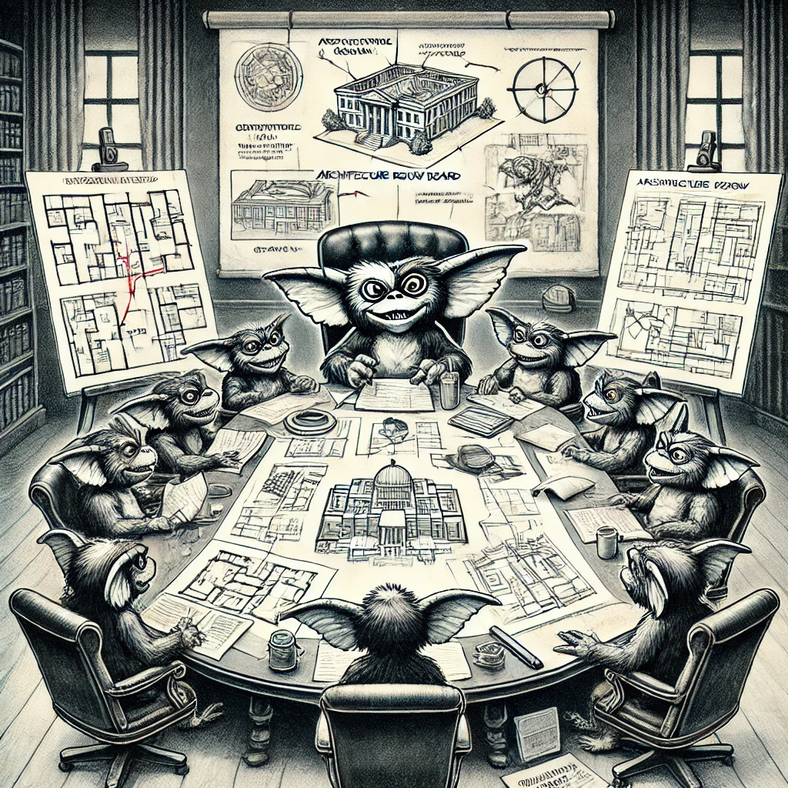

# Weekly Architectural Review Board (ARB) Meeting Structure

## Objective
To review, discuss, and provide feedback on architectural decisions, technical deviations, and new technology proposals.

## Audience
- **Primary**: Architects, Tech Leads
- **Optional**: Engineers or subject-matter experts relevant to specific agenda items

## Meeting Cadence
Weekly, 1 hour

---

## Meeting Format

### Pre-Meeting Preparation
- **Agenda Publication**: Publish the agenda 2 days before the meeting, along with links to any Architecture Decision Records (ADRs) or supporting documentation.
- **Documentation Requirements**:
  - **Item Description**: Each agenda item should include a concise summary of what will be discussed.
  - **Action Needed**: Indicate what is required from the ARB (feedback, approval, advice, etc.).
  - **Read-ahead**: Specify if participants need to review any linked documents before the meeting. Items requiring pre-meeting review should include a brief summary (one to two sentences) describing the document's purpose.

### Meeting Agenda
- **Kickoff (5 mins)**: Brief summary of the agenda and objectives.
- **Agenda Item Discussions (50 mins)**:
  - **Discussion Format**:
    - **Presenter Briefing** (3-5 mins per item): The presenter summarizes the problem, proposed solution, and what is needed from the ARB.
    - **Q&A / Discussion** (5-10 mins per item): The ARB provides feedback, questions, and suggestions.
    - **Decision or Next Steps**: Document any decisions made, actions to be taken, or need for further discussion.
- **Wrap-up and Action Summary (5 mins)**: The facilitator recaps the key takeaways, decisions made, and action items.

### Post-Meeting
- **Documentation of Decisions**: Summarize the outcomes of the meeting, updating any ADRs or creating new ones as necessary.
- **Action Follow-up**: Share a summary of action items with relevant stakeholders.

---

## Rules for Attendees

### 1. Pre-Meeting Preparation
- **Review Agenda and Documentation**: Attendees must review the agenda and any marked read-ahead documentation in advance.
- **Be Prepared to Discuss**: Attendees should come ready with feedback or insights on the agenda items.

### 2. Presenting an Agenda Item
- **Provide Clear Documentation**: Presenters must link to a well-documented ADR or other materials. Include a one-paragraph overview in the agenda describing the topic and the intended outcome.
- **Define the Ask**: Clearly articulate the type of feedback or decision needed from the ARB.
- **Be Concise**: Aim to present items efficiently, focusing on the core points and decision needs.

### 3. During the Meeting
- **Stay Focused**: Discussions should be concise and focused on the decision or feedback required.
- **Participate Actively**: Be engaged and prepared to contribute relevant insights.
- **Document Outcomes**: Record any final decisions or actions needed, ensuring they are assigned to specific people.

### 4. Post-Meeting Follow-through
- **Update Documentation**: Presenters are responsible for updating any ADRs or documentation based on the feedback.
- **Complete Action Items**: Ensure follow-up on any assigned actions promptly.

---

By keeping the ARB structure lightweight, focused, and action-oriented, we ensure that architectural discussions are efficient and valuable, fostering alignment without excessive overhead.
