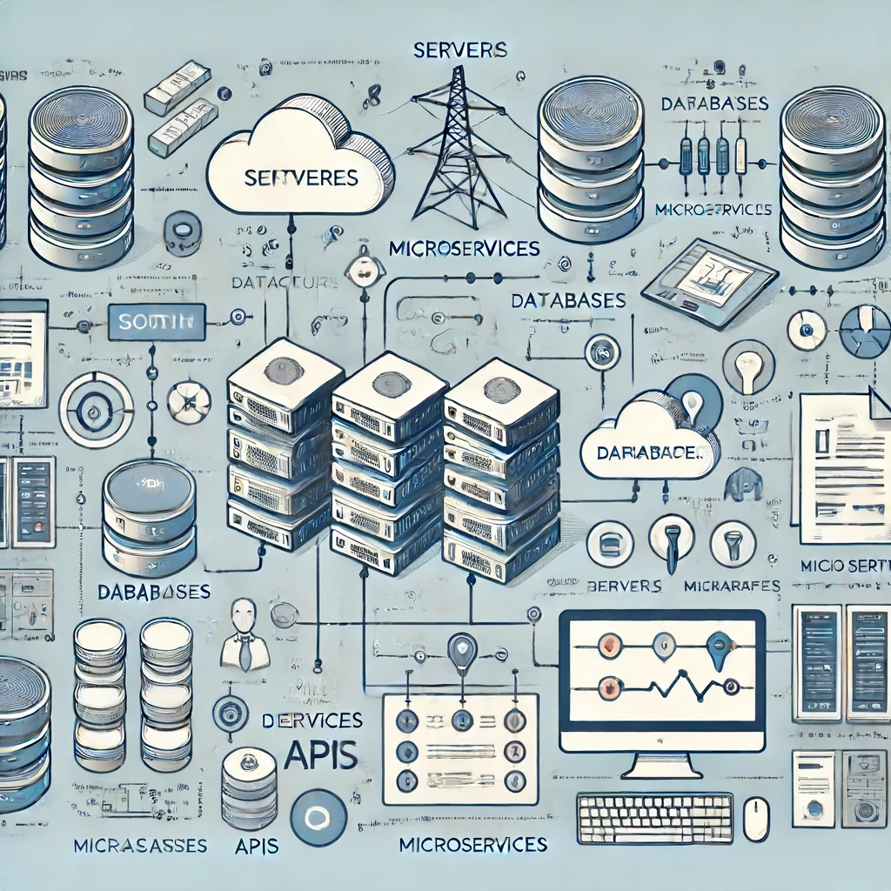

### Most Important Aspects of Software Architecture

**Objective:**

To ensure that software architecture is robust, scalable, maintainable, and aligned with business goals, thereby supporting the overall success of the software system.

### 1. Scalability

| Aspect                  | Description                                                                                     | Techniques                                        |
|-------------------------|-------------------------------------------------------------------------------------------------|---------------------------------------------------|
| Horizontal Scalability  | Ability to add more instances of a system to handle increased load                              | Load balancing, clustering                        |
| Vertical Scalability    | Ability to add more resources (CPU, memory) to existing instances to handle increased load      | Resource optimization, upgrading hardware         |

### 2. Performance

| Aspect          | Description                                                     | Techniques                                               |
|-----------------|-----------------------------------------------------------------|----------------------------------------------------------|
| Response Time   | Time it takes for the system to respond to user actions         | Caching, efficient algorithms, optimized queries         |
| Throughput      | Number of transactions the system can process within a timeframe | Asynchronous processing, parallel execution              |

### 3. Maintainability

| Aspect      | Description                                                                                   | Techniques                                                  |
|-------------|-----------------------------------------------------------------------------------------------|-------------------------------------------------------------|
| Modularity  | Designing the system in discrete modules or components that can be developed and maintained independently | Microservices architecture, encapsulation, separation of concerns |
| Code Quality| Ensuring the code is clean, readable, and follows best practices and coding standards         | Static code analysis tools, code reviews, automated testing |

### 4. Security

| Aspect                | Description                                                                                   | Techniques                                 |
|-----------------------|-----------------------------------------------------------------------------------------------|--------------------------------------------|
| Authentication        | Ensuring that users are who they claim to be                                                   | OAuth, JWT                                 |
| Authorization         | Ensuring that users have permission to perform actions                                         | Role-based access control (RBAC)           |
| Data Protection       | Ensuring data is protected at rest and in transit                                              | Encryption, secure communication protocols |

### 5. Reliability

| Aspect           | Description                                                                                   | Techniques                                 |
|------------------|-----------------------------------------------------------------------------------------------|--------------------------------------------|
| Fault Tolerance  | Ability of the system to continue operating properly in the event of component failure         | Redundancy, failover mechanisms, graceful degradation |
| Recovery         | Ability of the system to recover from failures and restore to a normal state                   | Backup and restore procedures, disaster recovery plans |

### 6. Usability

| Aspect                | Description                                                                                   | Techniques                                 |
|-----------------------|-----------------------------------------------------------------------------------------------|--------------------------------------------|
| User Interface Design | Ensuring the interface is intuitive and easy to use                                            | User-centered design principles, usability testing, accessibility standards |
| User Experience       | Ensuring the overall experience of the user is smooth and meets their needs                    | User feedback, performance monitoring, continuous improvement |

### 7. Flexibility and Extensibility

| Aspect           | Description                                                                                   | Techniques                                 |
|------------------|-----------------------------------------------------------------------------------------------|--------------------------------------------|
| Configurability  | Ability to adjust the system’s settings and behaviors without changing the code               | Configuration files, environment variables, feature toggles |
| Extensibility    | Ability to add new features or modify existing ones with minimal impact on the existing system | Plugins, APIs, modular design              |

### 8. Interoperability

| Aspect                | Description                                                                                   | Techniques                                 |
|-----------------------|-----------------------------------------------------------------------------------------------|--------------------------------------------|
| Integration           | Ability to interact with other systems and services                                            | APIs, web services, message queues         |
| Data Exchange         | Ability to exchange data seamlessly with other systems                                         | Standardized data formats (JSON, XML), data transformation tools |

### 9. Cost Efficiency

| Aspect                | Description                                                                                   | Techniques                                 |
|-----------------------|-----------------------------------------------------------------------------------------------|--------------------------------------------|
| Development Costs     | Managing the costs associated with developing and maintaining the software                    | Efficient development practices, automation, cost-effective tools and technologies |
| Operational Costs     | Managing the costs associated with running and scaling the software                           | Cloud services, serverless architectures, efficient resource management |

### Conclusion

By focusing on these critical aspects of software architecture, architects can design systems that are not only technically robust and efficient but also aligned with business goals, ensuring long-term success and adaptability.
