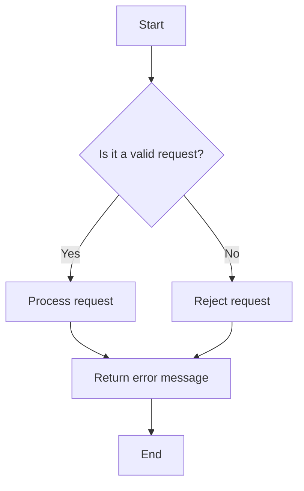
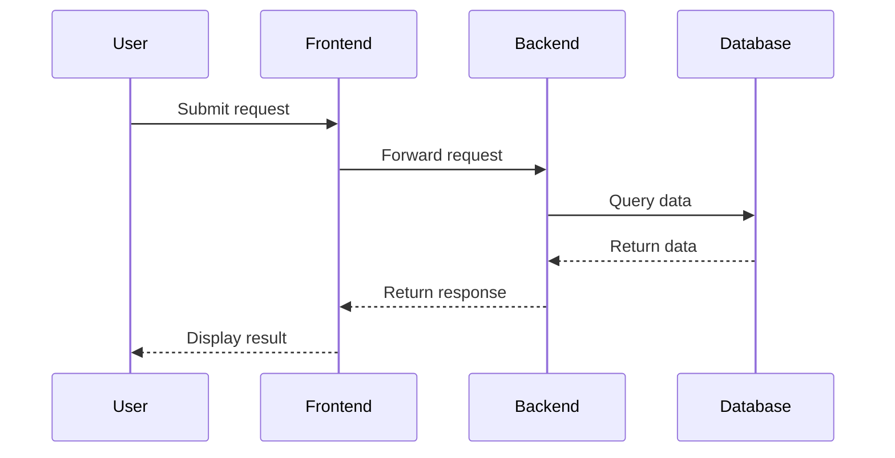

### Diagrams as Code for Architecture Visualization


#### Objective:
To streamline and standardize the creation and maintenance of architecture diagrams using "diagrams as code" tools. This proposal suggests using Structurizr for C4 diagrams and AWS Labs' diagram-as-code tool for defining AWS architecture diagrams as YAML. The goal is to incorporate these tools into the application codebase, ensuring that diagrams remain up-to-date and reflective of the current system architecture.

---

### Benefits of Diagrams as Code

1. **Consistency**: Ensures that all diagrams follow a standardized format and are automatically updated with changes in the codebase.
2. **Version Control**: Diagrams are stored as code, enabling version control and collaboration through git.
3. **Automation**: Integrates with CI/CD pipelines for automated generation and validation of diagrams.
4. **Documentation**: Provides up-to-date and easily accessible architecture documentation.

### Proposed Tools

1. **Structurizr**: For creating C4 diagrams which include Context, Container, Component, and Code diagrams.
   - **Website**: [Structurizr](https://structurizr.com/)
   - **Language Support**: Java, TypeScript, C#, Python, and more.
2. **AWS Labs' diagram-as-code tool**: For defining AWS architecture diagrams using YAML.
   - **GitHub**: [AWS Labs diagram-as-code](https://github.com/awslabs/diagram-as-code)
3. **Mermaid**: For managing code-level diagrams such as flowcharts and sequence diagrams.
   - **Website**: [Mermaid](https://mermaid-js.github.io/)
   - **Language Support**: JavaScript, Markdown.
4. **Other Tools**: Consider additional tools for generating diagrams using various languages:
   - **[Graphviz](https://graphviz.org/)**: For creating diagrams using the DOT language.
   - **[PlantUML](https://github.com/plantuml/plantuml)**: For creating diagrams using a simple textual description.
   - **[Diagrams](https://pypi.org/project/diagrams/)**: A Python library for creating diagrams using code.

### Types of Diagrams

1. **Architecture Diagrams**: High-level overviews of the system architecture.
2. **Deployment Diagrams**: Depict the deployment of software components in the infrastructure.
3. **System Diagrams**: Detailed views of system components and their interactions.
4. **Flow Diagrams**: Illustrate the flow of data or control through the system.
5. **Context Diagrams**: High-level diagrams showing the system and its environment.
6. **Component Diagrams**: Detailed diagrams of individual components and their relationships.

### Sample Repository Layout

```bash
/project-root
│
├── /src                   # Application source code
│   ├── /main
│   └── /test
│
├── /docs                  # Documentation
│   ├── /architecture
│   │   ├── context
│   │   │   ├── context-diagram.dsl
│   │   │   └── context-diagram.png
│   │   ├── container
│   │   │   ├── container-diagram.dsl
│   │   │   └── container-diagram.png
│   │   ├── component
│   │   │   ├── component-diagram.dsl
│   │   │   └── component-diagram.png
│   │   └── deployment
│   │       ├── deployment-diagram.yaml
│   │       └── deployment-diagram.png
│   │   └── code-level
│   │       ├── flow-diagram.mmd
│   │       └── flow-diagram.png
│   │       ├── sequence-diagram.mmd
│   │       └── sequence-diagram.png
│   └── /aws
│       ├── aws-architecture.yaml
│       └── aws-architecture.png
│
├── /scripts               # Automation scripts
│   ├── generate-diagrams.sh
│   └── validate-diagrams.sh
│
├── .gitignore
├── README.md
└── pom.xml (or build.gradle, etc.)

```

### Design Framework

1. **Define Diagrams in Code**: Use Structurizr DSL or other suitable DSLs to define architecture diagrams. Use YAML for AWS architecture diagrams.
2. **Version Control**: Store all diagram definitions in the repository under the `/docs` directory.
3. **Automation**: Create scripts for generating and validating diagrams.
   - **generate-diagrams.sh**: Script to generate diagrams from DSL/YAML files.
   - **validate-diagrams.sh**: Script to validate the diagrams during CI/CD pipeline execution.
4. **CI/CD Integration**: Integrate the generation and validation scripts into the CI/CD pipeline.
   - Example GitHub Actions Workflow:
```yaml
name: Diagrams CI

on: [push, pull_request]

jobs:
  generate-validate-diagrams:
    runs-on: ubuntu-latest

    steps:
    - name: Checkout code
      uses: actions/checkout@v2

    - name: Set up JDK
      uses: actions/setup-java@v1
      with:
        java-version: '11'

    - name: Install dependencies
      run: ./mvnw install

    - name: Generate Diagrams
      run: ./scripts/generate-diagrams.sh

    - name: Validate Diagrams
      run: ./scripts/validate-diagrams.sh

    - name: Upload Diagrams
      uses: actions/upload-artifact@v2
      with:
        name: Diagrams
        path: docs/architecture/**/*.png
```

### Example Diagrams and Tools

1. **Structurizr**:
   - Create context diagrams, container diagrams, and component diagrams using Structurizr DSL.
```dsl
workspace {

    model {
        user = person "User"
        softwareSystem = softwareSystem "Software System" {
            webapp = container "Web Application" {
                user -> this "Uses"
            }
        }
    }

    views {
        systemContext softwareSystem {
            include *
            autolayout lr
        }
    }

    theme default
}

```
2. **AWS Labs' diagram-as-code**:
   - Define AWS architecture diagrams using YAML configurations.
```yaml
Resources:
  VPC:
    Type: AWS::EC2::VPC
    Properties:
      CidrBlock: 10.0.0.0/16
  InternetGateway:
    Type: AWS::EC2::InternetGateway
  VPCGatewayAttachment:
    Type: AWS::EC2::VPCGatewayAttachment
    Properties:
      VpcId: !Ref VPC
      InternetGatewayId: !Ref InternetGateway

```

3. **Mermaid**:
   - Create flowcharts and sequence diagrams to manage code-level diagrams in Markdown or JavaScript.
   #### Flow Diagram
```
graph TD
    A[Start] --> B{Is it a valid request?}
    B -- Yes --> C[Process request]
    B -- No --> D[Reject request]
    C --> E[Return response]
    D --> E[Return error message]
    E --> F[End]
```


  #### Sequence Diagram
```
sequenceDiagram
    participant User
    participant Frontend
    participant Backend
    participant Database

    User->>Frontend: Submit request
    Frontend->>Backend: Forward request
    Backend->>Database: Query data
    Database-->>Backend: Return data
    Backend-->>Frontend: Return response
    Frontend-->>User: Display result
```


### Conclusion

Implementing diagrams as code ensures that architecture diagrams are consistent, version-controlled, and integrated with the development workflow. By using tools like Structurizr and AWS Labs' diagram-as-code, we can automate the generation and validation of diagrams, providing clear and up-to-date documentation that evolves with the codebase.

This approach not only enhances documentation accuracy but also promotes collaboration and understanding across teams, ensuring that everyone has access to the latest architectural views of the system.