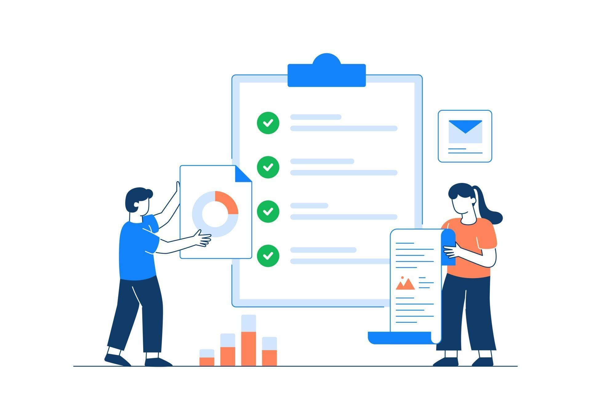

### Sample Progress Report for Gremlins Inc.

#### Progress Report: Month 1-2

**Reporting Period:** [Start Date] - [End Date]  
**Report Date:** [Current Date]  
**Prepared by:** [Your Name]  

### 1. Executive Summary

During the first two months of the roadmap implementation, we focused on preparation and assessment. Key activities included stakeholder alignment, comprehensive assessments of current processes and documentation, and identification of key gaps and areas for improvement.

### 2. Key Activities and Milestones

| Activity                               | Status          | Details                                                                                  |
|----------------------------------------|-----------------|------------------------------------------------------------------------------------------|
| **Stakeholder Kick-off Meeting**       | Completed       | Held on [Date]. All key stakeholders attended. Objectives and roadmap presented.          |
| **Weekly Email Updates**               | Ongoing         | Sent weekly updates to stakeholders summarizing progress and issues.                      |
| **Assessment of Deployment Processes** | Completed       | Conducted a thorough assessment of current deployment processes.                          |
| **Assessment of Architecture Documentation** | Completed       | Evaluated existing architecture documentation for completeness and accuracy.              |
| **Gap Analysis**                       | Completed       | Identified key gaps and areas for improvement in processes and documentation.              |
| **Assessment Reports**                 | Completed       | Detailed assessment reports shared with stakeholders on [Date].                           |

### 3. Achievements

- Successfully aligned all stakeholders with the project objectives and roadmap.
- Completed comprehensive assessments of current deployment processes and architecture documentation.
- Identified and documented key gaps and areas for improvement.
- Maintained consistent communication through weekly email updates.

### 4. Issues and Concerns

| Issue/Concern                          | Impact          | Mitigation Plan                                                                          |
|----------------------------------------|-----------------|------------------------------------------------------------------------------------------|
| Limited stakeholder availability       | Medium          | Scheduled meetings well in advance and provided detailed agendas to ensure attendance.    |
| Resistance to change in processes      | High            | Conducted additional sessions to explain benefits and address concerns.                   |

### 5. Next Steps

#### Phase 2: Strategy Development (Month 3-4)

**Key Activities:**
- Develop GitOps adoption strategy.
- Define the transition plan for migrating architecture diagrams to the C4 model using Structurizr.
- Outline the approach for converting static documentation to dynamic reference architecture examples.
- Create a tech radar and maturity model.

**Timeline:**
- Week 9-10: Develop GitOps strategy.
- Week 11-12: Create C4 model transition plan.
- Week 13-14: Outline dynamic documentation strategy.
- Week 15-16: Develop tech radar and maturity model.

### 6. Resource Utilization

| Resource Type         | Allocated       | Utilized       | Comments                                                                            |
|-----------------------|-----------------|----------------|-------------------------------------------------------------------------------------|
| **Project Manager**   | 1 FTE           | 1 FTE          | Effectively managed stakeholder meetings and assessment activities.                  |
| **Architects**        | 2 FTE           | 2 FTE          | Conducted assessments of current architecture documentation and processes.           |
| **Business Analysts** | 1 FTE           | 1 FTE          | Performed gap analysis and compiled assessment reports.                              |
| **Budget**            | $20,000         | $18,000        | Spent on initial assessments, tools for documentation, and meeting expenses.         |

### 7. Risk Management

| Risk                                  | Likelihood     | Impact         | Mitigation Plan                                                                      |
|---------------------------------------|----------------|----------------|--------------------------------------------------------------------------------------|
| Delays in stakeholder feedback        | Medium         | Medium         | Set clear deadlines and follow up regularly to ensure timely feedback.               |
| Insufficient resource allocation      | Low            | High           | Monitor resource utilization closely and adjust allocations as necessary.            |

### 8. Feedback and Recommendations

- **Feedback:** Stakeholders have expressed appreciation for the detailed assessments and clear communication.
- **Recommendations:** Continue with regular updates and involve stakeholders in strategy development to ensure alignment.

### 9. Conclusion

The preparation and assessment phase was successfully completed, with all key activities and milestones achieved. We are now well-positioned to proceed with strategy development in the next phase.

**Prepared by:**  
[Your Name]  
[Your Title]  
Gremlins Inc.  

**Approved by:**  
[Approver's Name]  
[Approver's Title]  
Gremlins Inc.

---

By following this progress report template, Gremlins Inc. can effectively communicate project status, achievements, issues, and next steps to all stakeholders, ensuring transparency and continued alignment with project objectives.
