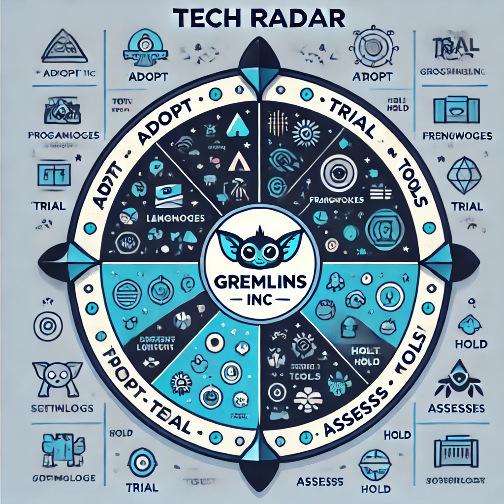
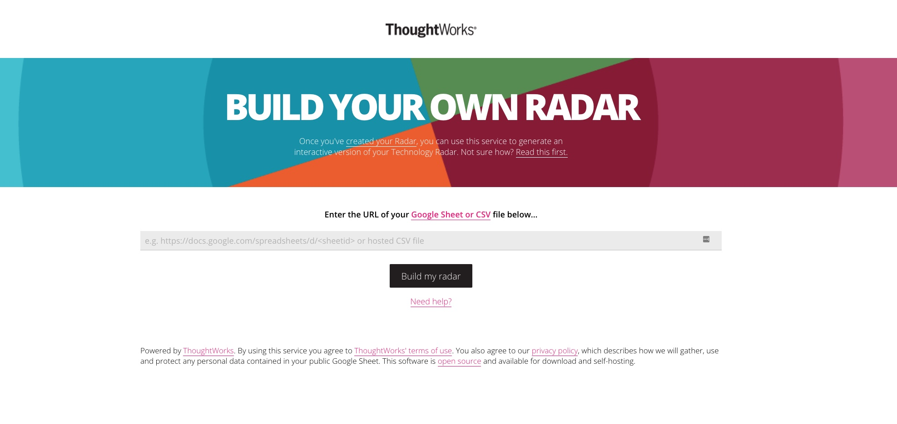

## Tech Radar
Gremlins interactive radar, inspired by [thoughtworks.com/radar](http://thoughtworks.com/radar)



### ThoughtWorks BYOR (Build your own radar)
Neal Ford created a great [walkthrough](https://www.thoughtworks.com/insights/blog/build-your-own-technology-radar) of the concept of what a tech radar is and how it's created. Thoughtworks also provide a great [video](https://www.thoughtworks.com/radar/byor) stepping through the process as well.


#### Run Locally
``` bash
$ docker pull wwwthoughtworks/build-your-own-radar
$ docker run --rm -p 8080:80 -e SERVER_NAMES="localhost 127.0.0.1" wwwthoughtworks/build-your-own-radar
$ open http://localhost:8080
```
#### Setting up your data

You need to make your data public in a form the app can digest.

Create a Google Sheet or Excel doc. Give it at least the below column headers, and put in the content that you want:

| name          | ring   | quadrant               | isNew | description                                             |
|---------------|--------|------------------------|-------|---------------------------------------------------------|
| Composer      | adopt  | tools                  | TRUE  | Although the idea of dependency management ...          |
| Canary builds | trial  | techniques             | FALSE | Many projects have external code dependencies ...       |
| Apache Kylin  | assess | platforms              | TRUE  | Apache Kylin is an open source analytics solution ...   |
| JSF           | hold   | languages & frameworks | FALSE | We continue to see teams run into trouble using JSF ... |

#### Using CSV data
The other way to provide your data is using CSV document format.
You can enter any URL that responds CSV data into the input field on the first page.
The format is just the same as that of the Google or Excel Sheet, the example is as follows:

```
name,ring,quadrant,isNew,description  
Composer,adopt,tools,TRUE,"Although the idea of dependency management ..."  
Canary builds,trial,techniques,FALSE,"Many projects have external code dependencies ..."  
Apache Kylin,assess,platforms,TRUE,"Apache Kylin is an open source analytics solution ..."  
JSF,hold,languages & frameworks,FALSE,"We continue to see teams run into trouble using JSF ..."  
```

Or simply export your Excel doc to csv.
***Note:*** The CSV file parsing is using D3 library, so consult the D3 documentation for the data format details.

#### Sharing the sheet

* In Google sheets, go to 'File', choose 'Publish to the web...' and then click 'Publish'.
* Close the 'Publish to the web' dialog.
* Copy the URL of your editable sheet from the browser (Don't worry, this does not share the editable version). 

The URL will be similar to [https://docs.google.com/spreadsheets/d/1waDG0_W3-yNiAaUfxcZhTKvl7AUCgXwQw8mdPjCz86U/edit](https://docs.google.com/spreadsheets/d/1waDG0_W3-yNiAaUfxcZhTKvl7AUCgXwQw8mdPjCz86U/edit). In theory we are only interested in the part between '/d/' and '/edit' but you can use the whole URL if you want.

#### Building the radar

Paste the URL in the input field on the home page at [http://localhost:8080](http://localhost:8080).

However, it is not perfect and has some issues and limitations. In this document, we enumerate them and describe what temporary measures we have put in place and the next steps for a long-lasting, maintainable solution. We also examine what could be alternative solutions to some of these issues.

## Issues with the original radar

ThoughtWorks Radar is more of a tool to build radars than a radar in itself. You can feed the tool with your radar data in two ways:

- A Google Sheet (public or private providing credentials)
- A CSV file accessed over HTTP

There is a fixed format (e.g., name, ring, quadrant, isNew, description) and a specific order for the data source entries. Furthermore, **whatever is hosting the radar needs access to the data source**. For example, if we were to host the CSV file in GitHub, we would have to use a public repository.

The other issue is with regards to user experience. When landing on the original radar's root page, you get presented with a simple textbox to input the URL where the data source lives.



Only when navigating to an URL like https://radar.my-domain./com?**sheetId=[URL to your data source]** does the actual radar appear, with blips distributed across quadrants and rings).


## What we want from the radar

If we were to put on our Product Owner hat and list what requirements we have for the radar, those would be:

- Treat the data source for the radar as code (i.e., store it in Git)
- Keep the data source and the actual radar code as close as possible
- When navigating to http://radar.gremlins.io s(or similar), load the data directly (instead of displaying the image above)
- Reduce maintainability effort as much as possible (e.g., avoid forking if possible)
- Reduce deployment complexity and resource utilisation


## What we have done so far

To achieve the list of features above (assuming you can't have your cake and eat it), we have decided to compromise on maintainability efforts and fork the radar to add a few small modifications.

With these modifications, we are capable of:

- Loading the blips from a local CSV file that is part of the container that runs the radar
- Load the radar page (instead of the image above) directly

While forking the radar is not desirable, it is likely to happen if we were to expose the radar externally. In that scenario, we would want to customise the radar beyond what ThoughtWorks provides out of the box. Some of the specific customisations would include:

- Gremlins own logo
- Specific text in the radar title
- Some modifications to the legal text in the footer section
- Touching on the colour palette to fit Gremlins design guidelines


## Alternatives

Instead of forking and modifying the radar, we could have opted for other solutions. For completeness, they are listed here (and can be re-evaluated) in the future.

### Using a private Google Sheet

Since ThoughtWorks radar supports Google Sheets behind authentication credentials, we could have opted for this option and feed the radar with one of them without being forced to make it public.

This option has two problems:

- Gremlins is not using (and doesn't have any plans) to use Google Suite, including Google Sheets. Instead, we are firmly set with Microsoft Office. Operationally, it might bring some challenges to add another product into our stack
- Whatever Google account hosted this sheet, we would either risk losing access if the person owning left Gremlins or having to manage a shared account (and its credentials), which would increase the operational burden

### Hosting the CSV file via httpd

It should be possible to craft a CSV file and serve it via httpd as described in [this issue](https://github.com/thoughtworks/build-your-own-radar/issues/51). That way, we would not need to change the ThoughtWorks radar code; also, Google Sheet would not be required.

In this case, we would create a separate application responsible for:
- Run the ThoughtWorks radar process
- Run the httpd process
- Somewhat intercept any request coming to the root page and, instead, redirect it to the appropriate address to make sure the radar would load by default

With this approach, we would use ThoughtWorks radar as originally intended: a tool to build radars instead of a radar itself.

We should re-evaluate this approach once we have a platform to run applications (and containers). We should also balance it against the (potential) need to customise the radar to make it public.
