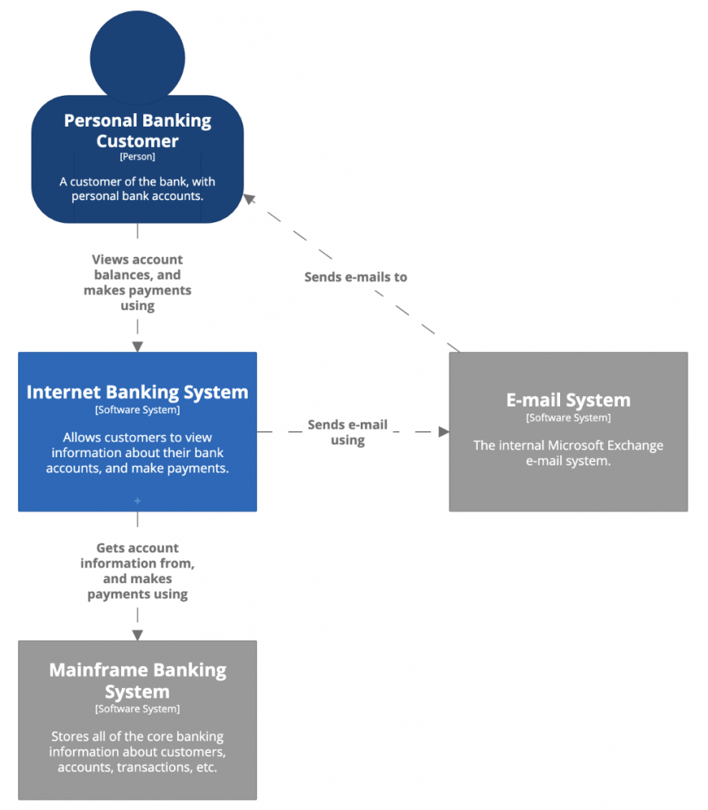
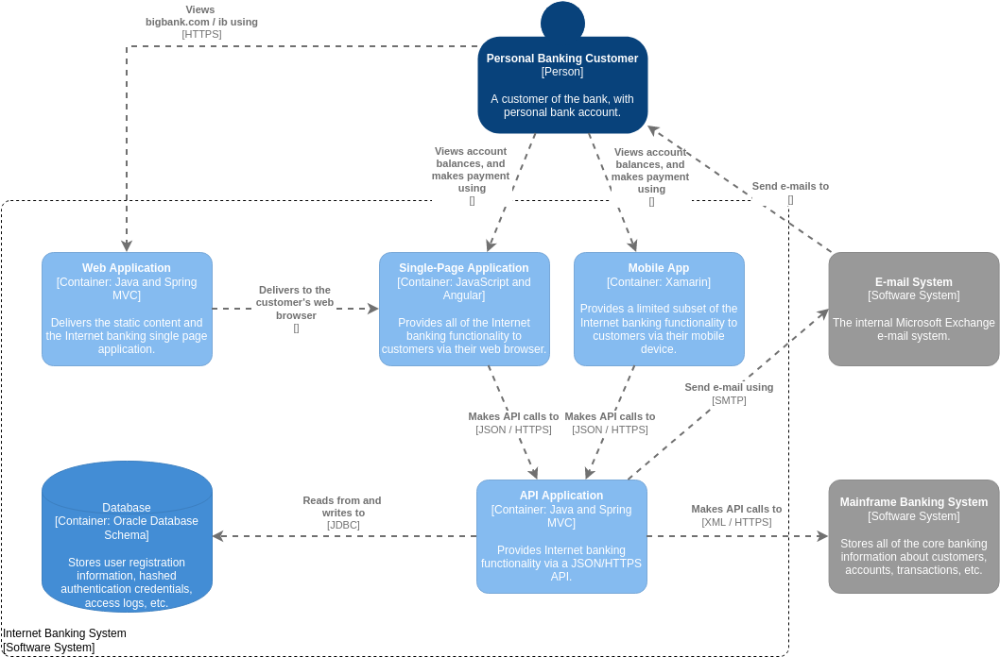
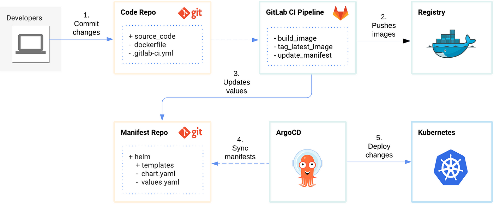

## Executive Summary

This report outlines the current state of our cloud-native system and proposes a set of recommendations to enhance our architecture documentation and deployment processes. The key recommendations include migrating our architecture diagrams to the C4 model, storing these diagrams as code using Structurizr, and adopting GitOps to improve deployment efficiencies.

## Table of Contents

1. Introduction
2. Current State Analysis
3. Proposed Migration to C4 Model
4. Structurizr for Architecture as Code
5. GitOps for Deployment Efficiencies
6. Implementation Plan
7. Conclusion

## 1. Introduction

As we continue to scale our cloud-native infrastructure, it is crucial to have a robust and efficient way to manage our architecture documentation and deployment processes. This report provides a detailed analysis of our current system and presents recommendations to improve our architecture management and CI/CD pipeline through the adoption of modern tools and methodologies.

## 2. Current State Analysis

### 2.1 Cloud-Native System Overview

Our current system leverages a cloud-native architecture deployed on [cloud provider], with microservices running in Docker containers orchestrated by Kubernetes. We use Jenkins for CI/CD pipelines to automate the build, test, and deployment processes.

### 2.2 CI/CD Pipeline Overview

The existing CI/CD pipeline includes:
- **Continuous Integration:** Automated testing and building of code using Jenkins.
- **Continuous Deployment:** Automated deployment of applications to the Kubernetes cluster.

### 2.3 Pain Points

- **Architecture Documentation:** Lack of standardized architecture documentation leads to inconsistencies and difficulties in understanding system components.
- **Deployment Inefficiencies:** Manual interventions required during deployments result in slower and error-prone processes.

## 3. Proposed Migration to C4 Model

### 3.1 Overview of C4 Model

The C4 model provides a simple yet powerful way to create architecture diagrams at different levels of abstraction:
- **Context Diagram:** High-level overview of the system and its interactions with external entities.
- **Container Diagram:** Detailed view of the system's containers and their interactions.
- **Component Diagram:** Breakdown of containers into components and their interactions.
- **Code Diagram:** Detailed view of the implementation of individual components.

### 3.2 Benefits of C4 Model

- **Standardization:** Provides a consistent approach to documenting system architecture.
- **Clarity:** Helps in understanding the system at different levels of abstraction.
- **Communication:** Facilitates better communication among stakeholders.

### 3.3 Example C4 Diagrams



*Figure 1: Example Context Diagram*



*Figure 2: Example Container Diagram*

## 4. Structurizr for Architecture as Code

### 4.1 Introduction to Structurizr

Structurizr is a tool for creating architecture diagrams using code. It supports the C4 model and allows for version-controlled, reproducible architecture diagrams.

### 4.2 Benefits of Structurizr

- **Version Control:** Architecture diagrams can be stored in version control systems (e.g., Git), enabling tracking of changes over time.
- **Consistency:** Ensures that diagrams are always up-to-date and consistent with the codebase.
- **Collaboration:** Facilitates collaboration among team members through shared repositories.

### 4.3 Example Structurizr Code

```java
Workspace workspace = new Workspace("My System", "Description of my system");
Model model = workspace.getModel();

Person user = model.addPerson("User", "A user of my system");
SoftwareSystem system = model.addSoftwareSystem("My System", "Description of my system");

user.uses(system, "Uses");

ViewSet views = workspace.getViews();
SystemContextView contextView = views.createSystemContextView(system, "SystemContext", "An example of a System Context diagram.");
contextView.addAllSoftwareSystems();
contextView.addAllPeople();

StructurizrClient structurizrClient = new StructurizrClient("apiKey");
structurizrClient.putWorkspace(1234, workspace);
```
*Figure 3: Example Structurizr Code for a Context Diagram*

## 5. GitOps for Deployment Efficiencies

### 5.1 Introduction to GitOps

GitOps is a methodology that uses Git as the single source of truth for declarative infrastructure and applications. Changes to the infrastructure and application configurations are made via pull requests and are automatically applied by a GitOps operator (e.g., Flux or Argo CD).

### 5.2 Benefits of GitOps

- **Automation:** Fully automates the deployment process, reducing manual interventions.
- **Traceability:** Every change is tracked in Git, providing a clear audit trail.
- **Consistency:** Ensures that the deployed state matches the desired state defined in Git.

### 5.3 Example GitOps Workflow

1. **Developer:** Commits changes to the application or infrastructure code.
2. **Pull Request:** A pull request is created and reviewed.
3. **Merge:** Changes are merged into the main branch.
4. **GitOps Operator:** Detects changes in the Git repository and automatically applies them to the cluster.



*Figure 4: Example GitOps Workflow*

## 6. Implementation Plan

### 6.1 Phase 1: Migration to C4 Model

- **Step 1:** Train the team on the C4 model.
- **Step 2:** Create initial C4 diagrams for the current system.
- **Step 3:** Review and refine the diagrams with stakeholders.

### 6.2 Phase 2: Adopt Structurizr

- **Step 1:** Set up Structurizr in the development environment.
- **Step 2:** Migrate existing C4 diagrams to Structurizr.
- **Step 3:** Integrate Structurizr with the version control system.

### 6.3 Phase 3: Implement GitOps

- **Step 1:** Choose a GitOps operator (e.g., Flux or Argo CD).
- **Step 2:** Set up the GitOps operator in the Kubernetes cluster.
- **Step 3:** Update CI/CD pipelines to use GitOps for deployments.

## 7. Conclusion

By migrating our architecture diagrams to the C4 model and storing them as code using Structurizr, we can ensure consistent and up-to-date documentation of our system architecture. Additionally, adopting GitOps will significantly improve our deployment efficiencies by automating the deployment process and ensuring consistency between our desired and deployed states. These recommendations will enhance our ability to manage and scale our cloud-native system effectively.

