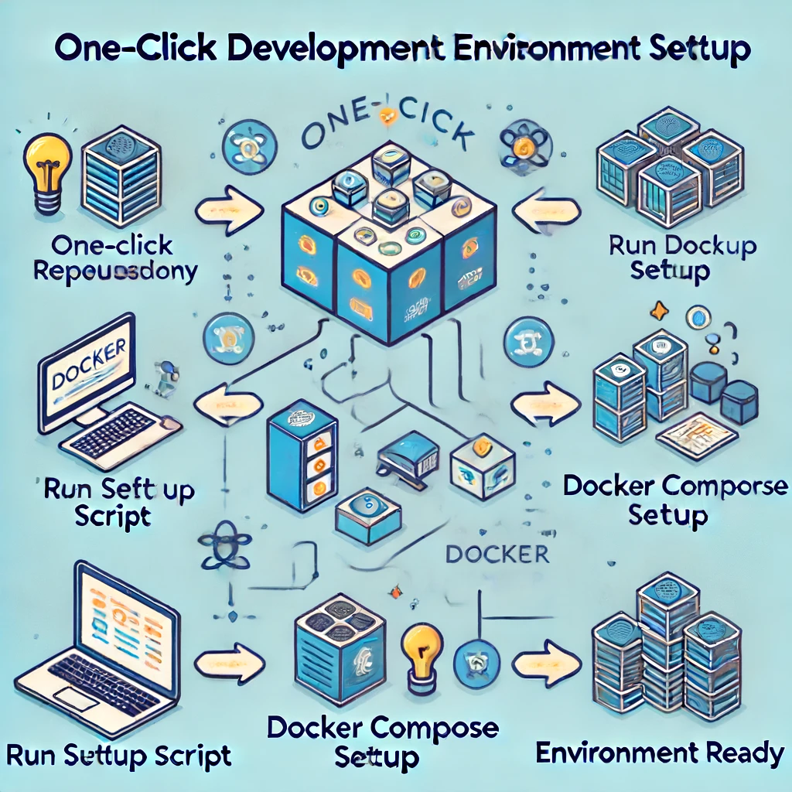

### Improving Local Development Environment Setup: Leveraging Automation and Containers

**Objective:**
To streamline the process of setting up a local development environment, making it quick, consistent, and easy for new developers to get started.

### Steps to Implement One-Click Local Development Environment Setup

#### 1. Containerization with Docker

**a. Create Docker Images:**
   - Develop Docker images for each service or component of the application. These images should include all necessary dependencies, configurations, and environment variables.
   - Example Dockerfile for a Node.js application:
     ```Dockerfile
     FROM node:14
     WORKDIR /usr/src/app
     COPY package*.json ./
     RUN npm install
     COPY . .
     EXPOSE 3000
     CMD ["node", "app.js"]
     ```

**b. Multi-Container Setup with Docker Compose:**
   - Use Docker Compose to define and run multi-container Docker applications. This allows you to run multiple services (e.g., databases, APIs, front-end) in a single command.
   - Example `docker-compose.yml`:
     ```yaml
     version: '3'
     services:
       web:
         build: .
         ports:
           - "3000:3000"
         volumes:
           - .:/usr/src/app
         environment:
           - NODE_ENV=development
       db:
         image: postgres:13
         environment:
           POSTGRES_USER: user
           POSTGRES_PASSWORD: password
           POSTGRES_DB: mydatabase
         ports:
           - "5432:5432"
     ```

#### 2. Automation with Scripts

**a. Initialization Scripts:**
   - Create scripts to automate the initialization of the development environment, such as pulling the latest code, setting up environment variables, and running Docker Compose.
   - Example `setup.sh` script:
     ```bash
     #!/bin/bash
     echo "Setting up local development environment..."
     git pull origin main
     docker-compose up --build -d
     echo "Environment setup complete. Application is running at http://localhost:3000"
     ```

**b. Pre-configured IDE Settings:**
   - Provide configuration files for popular IDEs (e.g., VS Code) that include workspace settings, recommended extensions, and debugging configurations.
   - Example `.vscode/settings.json`:
     ```json
     {
       "editor.tabSize": 2,
       "files.autoSave": "onFocusChange",
       "docker.dockerComposeBuild": true
     }
     ```

#### 3. Documentation and Onboarding Guide

**a. Comprehensive Documentation:**
   - Write detailed documentation that explains the setup process, how to use the provided scripts, and how to troubleshoot common issues.
   - Example README.md snippet:
     ```markdown
     ## Local Development Setup
     Follow these steps to set up your local development environment:

     1. Clone the repository:
        ```bash
        git clone https://github.com/example/repo.git
        cd repo
        ```

     2. Run the setup script:
        ```bash
        ./setup.sh
        ```

     3. Open your browser and navigate to `http://localhost:3000`.

     For more information, see the [troubleshooting guide](docs/troubleshooting.md).
     ```

**b. Onboarding Guide:**
   - Create an onboarding guide specifically for new developers that walks them through the entire setup process, including screenshots and step-by-step instructions.

### Benefits of One-Click Local Development Setup

1. **Consistency:**
   - Ensures all developers are working in identical environments, reducing the likelihood of "works on my machine" issues.

2. **Speed:**
   - Significantly reduces the time required to set up a development environment, allowing new developers to start contributing more quickly.

3. **Ease of Use:**
   - Simplifies the onboarding process for new developers, making it less intimidating and more accessible.

4. **Maintainability:**
   - Centralizes environment configurations, making it easier to update dependencies and configurations across the team.

By leveraging Docker for containerization and automation scripts for setup, you can create a streamlined, one-click process for setting up a local development environment. This approach enhances efficiency, consistency, and developer experience, ultimately contributing to a more productive and collaborative team.
