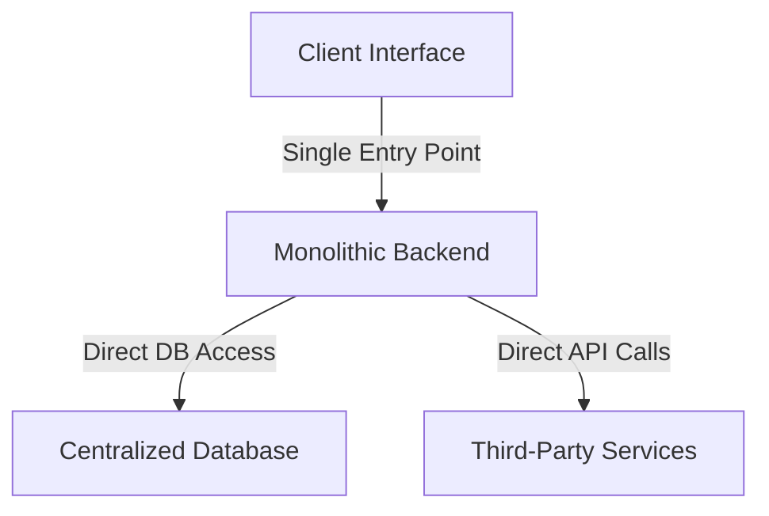
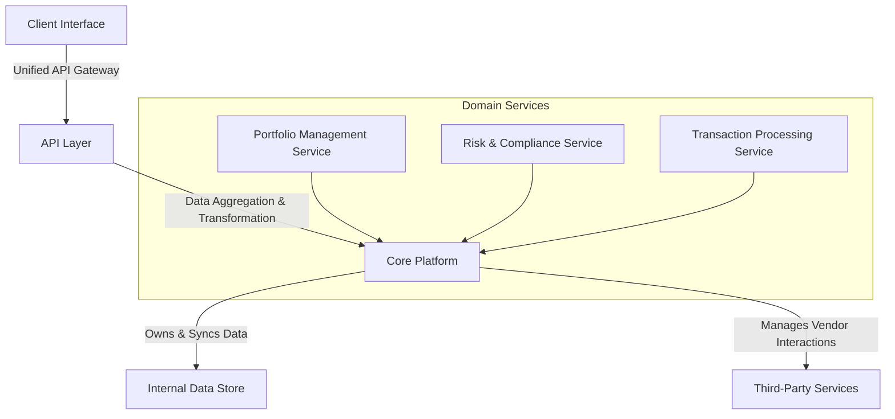

# **Detailed Write-Up: Architecture Vision & Practices**

## **1. Introduction: The Role of Architecture in a Modern Technology Organization**

### **Why Architecture Matters**
For any organization that builds or relies on technology, architecture plays a foundational role in ensuring systems are scalable, resilient, cost-effective, and aligned with business strategy. However, many business leaders see architecture as an "engineering concern," while many engineers view business alignment as outside their remit. The reality is that architecture is the **bridge between business and technology**, ensuring that technical investments deliver real business value.

Companies with strong architectural practices, such as **Amazon, Netflix, Google, Microsoft, Revolut, Wise, and Monzo**, have demonstrated that **well-defined architectural strategies lead to faster innovation, cost efficiency, and stronger market positions.**

### **Key Goals of a Strong Architecture Function**
1. **Scalability** – Ensuring systems can grow efficiently with increasing demand **without exponential increases in operational costs**.
2. **Resilience** – Building fault-tolerant, highly available architectures that prevent downtime.
3. **Modularity & Maintainability** – Reducing complexity through well-defined system boundaries, allowing independent team ownership and faster feature delivery.
4. **Cost Efficiency** – Optimizing infrastructure and engineering efforts to **reduce operational expenses** (OPEX) and **maximize return on investment (ROI).**
5. **Business Alignment** – Ensuring architecture decisions support business objectives and create long-term value.

---

# **Architecture Vision & Strategy Detailed Write-Up**

## **Analogy: Poor vs. Good Architecture Design and Governance**

### **Poor Architecture Design: The "Unplanned City"**
Imagine a city that **grows without any planning**. Roads are built haphazardly, buildings are stacked wherever space is available, and utilities (water, electricity, and gas) are laid out inconsistently. Over time:

- Traffic congestion worsens.
- Power outages become frequent.
- Expanding the city becomes a nightmare because every new addition disrupts existing infrastructure.

This is what happens when **an enterprise system is built without architecture governance**:
- Different teams **build ad-hoc services** with no standardization.
- **Technical debt accumulates**, making new features harder to implement.
- **Scalability issues** arise as infrastructure cannot support increased loads.
- **Security risks** emerge due to inconsistent access controls.

---

### **Good Architecture Design: The "Planned Smart City"**
Now, imagine a **well-planned smart city**. Roads follow a structured grid, public transport integrates seamlessly, and critical infrastructure is designed with **future growth in mind**. When new districts are added, they connect smoothly to the existing system without disruption.

This reflects a **modern, well-governed architecture**:
- **Modular, service-oriented systems** allow easy integration and updates.
- **Scalability is built-in**, enabling seamless expansion.
- **Security and compliance** are enforced across all systems.
- **Technical debt is minimized** through regular refactoring and best practices.

---

## **Before and After Architecture Diagrams for an Asset Management System**

### **Before: Monolithic Asset Management System (Legacy Architecture)**

#### **Problems with This Approach:**
- **All functionalities are tightly coupled**, making changes risky and time-consuming.
- **Performance bottlenecks** as all requests go through a single monolithic backend.
- **Vendor lock-in** due to direct integration with third-party services.
- **Data inconsistency** as all transactions rely on a centralized database.

---

### **After: Modular, Scalable Asset Management System (Service-Oriented Architecture)**

#### **Benefits of This Approach:**
- **API Gateway abstracts complexity**, allowing independent front-end experiences.
- **Core Platform centralizes business logic**, improving **data consistency**.
- **Domain services scale independently**, improving **performance and resilience**.
- **Third-party dependencies are modularized**, enabling easy replacement or upgrades.

---

## **Conclusion**
A well-architected system provides **better scalability, flexibility, and performance** while reducing **technical debt and operational risks**. The transition from a **monolithic, tightly coupled system** to a **modular, service-oriented architecture** ensures **long-term business agility and innovation**. By following structured architectural governance, organizations can build **resilient, future-proof technology ecosystems**.

---
## **2. The Importance of Mature Architecture Practices**

### **2.1 The Role of Business and Technical Architects**

#### **Business Architects: Connecting Technology to Business Strategy**
Many business leaders are unfamiliar with **Business Architecture**, yet it is critical to ensuring that technology investments align with business goals. Business Architects play an essential role in:

1. **Crafting Business Plans for Technology Investments** – Translating technical opportunities into business proposals with financial models, projected ROIs, and justifications for funding.
2. **Developing Business Capability Models** – Mapping out the **core competencies of the business** and identifying gaps where technology can create efficiencies or new revenue opportunities.
3. **Aligning Product Strategy with Technical Feasibility** – Ensuring product roadmaps are feasible given **current technical capabilities** while advocating for strategic investments that support future growth.
4. **Explaining ROI to Technology Teams** – Helping engineers understand the business value of architectural decisions, so they can balance **cost, complexity, and risk** when designing solutions.

📌 **Example:** **Revolut’s strong financial modeling for feature development** ensures that every major product feature—such as their foreign exchange and crypto trading services—is backed by detailed **business cases and revenue impact analysis** ([Source: Revolut Engineering Blog](https://www.revolut.com/engineering)).

#### **Technical Architects: Enabling Scalable, Cost-Effective Systems**
Technical Architects are responsible for ensuring that systems are **designed for long-term sustainability, efficiency, and adaptability.** Their role includes:
1. **Defining Scalable System Architectures** – Ensuring infrastructure and applications can support increasing loads **without performance degradation or increasing operational headcount**.
2. **Implementing Cost-Optimized Cloud Strategies** – Balancing **pay-per-use models** (e.g., AWS Lambda, Google Cloud Run) against long-term reserved cloud capacity for predictable workloads.
3. **Ensuring Security, Compliance, and Data Integrity** – Especially critical in regulated industries such as **fintech and asset management**.
4. **Providing Clear Technical Guidance to Engineering Teams** – Developing architectural blueprints and coding standards that ensure consistency and reduce maintenance overhead.

📌 **Example:** **Wise’s microservices and event-driven architecture** enables **real-time cross-border payments** while maintaining strict compliance with financial regulations ([Source: Wise Engineering Blog](https://www.wise.com/engineering)).

---

## **3. Scaling Beyond Technology: Operational Scalability**
### **3.1 Why Operational Scalability is Critical**
While **technical scalability** ensures that systems handle increased traffic and processing loads efficiently, **operational scalability** ensures that business growth does not require **exponential increases in customer service or operational staff**. Companies that fail to achieve operational scalability often face:

- **Rising customer service costs** due to inefficient support systems.
- **Inefficiencies in back-office processes**, causing bottlenecks in order fulfillment, payments, and compliance.
- **Increased manual workload**, reducing agility and increasing human error rates.

📌 **Example:** **Stripe’s automated fraud detection and risk assessment systems** allow it to scale payments globally **without requiring large compliance and operations teams** ([Source: Stripe Engineering](https://stripe.com/blog)).

### **3.2 Strategies for Achieving Operational Scalability**
1. **Automate Repetitive Tasks** – Implement AI-driven customer support, automated onboarding flows, and workflow automation.
2. **Design for Self-Service** – Enable customers to resolve issues independently through knowledge bases, chatbots, and intuitive UI/UX.
3. **Optimize Internal Processes** – Utilize **business process automation (BPA)** to streamline finance, HR, and compliance operations.
4. **Leverage Data & AI for Decision-Making** – Implement machine learning models to predict **customer behavior, fraud risk, and operational inefficiencies**.

📌 **Example:** **Monzo’s customer service automation platform** reduced the need for live agent intervention by **automating 70% of customer queries** ([Source: Monzo Engineering](https://monzo.com/blog/engineering)).

---

## **4. Decision Making & Capturing Architectural Context**

### **4.1 Why Capturing Decision Context Matters**
Every architectural decision is made in a specific business, technical, and market context. Without proper documentation, future teams may struggle to understand why certain choices were made, leading to repeated debates, avoidable rework, and inefficient system evolution.

Documenting decisions enables:
- **Better transparency and accountability** across business and technology teams.
- **More informed future decision-making** based on historical context.
- **Improved alignment between stakeholders**, reducing confusion and debate on past choices.

📌 **Example:** **Monzo’s "decision records" framework** ensures that every major technical choice is documented, tagged with relevant business considerations, and easily retrievable ([Source: Monzo Engineering](https://monzo.com/blog/engineering)).

### **4.2 Formal vs. Informal Decisions**
#### **Formal Decisions**
- **Definition:** Strategic, long-term architectural decisions that impact multiple teams, business lines, or core infrastructure.
- **Examples:**
  - Migrating a legacy monolith to a microservices architecture.
  - Adopting a new cloud provider or database technology.
  - Defining API contracts that multiple teams depend on.
- **Documentation Methods:**
  - **Architectural Decision Records (ADRs)** – A structured, version-controlled document outlining the problem, decision, alternatives considered, and consequences.
  - **Architecture Review Boards (ARBs)** – Governance processes where senior architects review, approve, and document key decisions.
  - **Technical RFCs (Request for Comments)** – A process where teams propose, debate, and finalize technical strategies collaboratively.

📌 **Example:** **Google's "Technical Design Document" (TDD) framework** ensures every significant technical decision is peer-reviewed before implementation ([Source: Google Engineering Practices](https://github.com/google/eng-practices)).

#### **Informal Decisions**
- **Definition:** Day-to-day technical decisions made within teams that do not have organization-wide impact but still benefit from being documented.
- **Examples:**
  - Choosing a specific library or framework within an existing stack.
  - Deciding the structure of a database schema for a new feature.
  - Performance optimizations within a single service.
- **Documentation Methods:**
  - **Slack or Confluence Decision Logs** – Simple, timestamped records of key discussions and agreements.
  - **GitHub PR Notes** – Using commit messages or pull request descriptions to capture technical reasoning.
  - **Internal Wiki Pages** – Lightweight, searchable documentation capturing key trade-offs and justifications.

📌 **Example:** **Atlassian’s "open documentation culture"** encourages engineers to document informal decisions in lightweight Confluence pages, ensuring cross-team visibility ([Source: Atlassian Tech Blog](https://www.atlassian.com/engineering)).

### **4.3 Referencing and Revisiting Past Decisions**
- **Why?** Business and technology landscapes evolve. Decisions that were correct at one time may no longer be optimal.
- **How?**
  - Maintain an **easily searchable archive** of past decisions.
  - Use **decision tags (e.g., "revisit in 12 months")** to trigger periodic reassessment.
  - Schedule **quarterly architecture review meetings** to evaluate past choices and adjust strategies.

📌 **Example:** **Netflix’s "Evolutionary Architecture" approach** includes revisiting past decisions every quarter to ensure continued alignment with business needs ([Source: Netflix Tech Blog](https://netflixtechblog.com/)).
---

## **5. Experimentation: Driving Architectural Evolution**

### **5.1 Why Experimentation Matters**

Architecture is not static. Successful companies continuously refine their technical practices, validate new approaches, and adapt to emerging technologies. Experimentation is key to:

- **Iteratively improving architectural practices** – Small-scale trials help refine governance, processes, and best practices before full adoption.
- **De-risking major technology decisions** – Running **technical Proof-of-Concepts (PoCs)** allows teams to test assumptions and avoid costly failures.
- **Driving innovation** – Companies that embrace experimentation adopt new technologies faster while maintaining business continuity.

📌 **Example:** **Netflix’s chaos engineering practice** uses controlled failures to improve system resilience. By deliberately breaking production systems in a controlled way, Netflix ensures its architecture is robust under real-world failure scenarios ([Source: Netflix Tech Blog](https://netflixtechblog.com/)).

### **5.2 Types of Experimentation in Architecture**

1. **Technical Proof-of-Concepts (PoCs)** – Short-term trials to validate new architectures, frameworks, or services.
   - 📌 **Example:** **Monzo's evaluation of Kubernetes vs. AWS Fargate** to determine the best fit for scaling their banking services.
   
2. **Incremental Process Improvements** – Experimenting with new architectural governance models or review processes.
   - 📌 **Example:** **Revolut's gradual rollout of ADRs (Architectural Decision Records)** helped streamline architecture discussions across globally distributed teams.
   
3. **A/B Testing for System Performance** – Running parallel implementations of different architectural patterns to measure real-world impact.
   - 📌 **Example:** **Google’s A/B testing of database sharding strategies** to optimize query performance at scale.

4. **Failover and Chaos Testing** – Intentionally introducing failures to measure system resilience and recovery times.
   - 📌 **Example:** **AWS’ “GameDays” simulate real-world incidents** to train engineers in rapid problem-solving and system recovery.

### **5.3 Frameworks for Experimentation**

1. **Hypothesis-Driven Development (HDD)** – Treating architecture changes as hypotheses that can be tested before full rollout.
2. **Lean Experimentation** – Running quick, low-cost tests before making irreversible commitments to a new technology.
3. **Canary Releases & Feature Flags** – Deploying changes to a small subset of users before a full rollout to minimize risk.

📌 **Example:** **Facebook’s feature flag system** enables rolling out infrastructure updates without disrupting the entire platform ([Source: Facebook Engineering](https://engineering.fb.com/)).

## **6. Managing Technical Debt: The Hidden Cost of Inaction**

gantt
    title Technical Debt Accumulation Timeline
    dateFormat  MM-YY
    section Development Phase
    🚀 Initial Build: done, a1, 01-22, 03-22
    🩹 Quick Fixes Introduced: done, a2, 04-22, 06-22
    
    section Growth & Scaling Issues
    ⚠️ Scaling Bottlenecks: done, a3, 07-22, 09-22
    🕸 Increased Complexity: done, a4, 10-22, 12-22
    
    section Operational Impact
    🐢 Performance Degradation: active, a5, 01-23, 04-23
    💸 Rising Maintenance Costs: active, a6, 05-23, 08-23
    
    section Critical Failure
    💀 Crisis Mode - Major Refactoring Required: crit, a7, 09-23, 12-23

### **6.1 What is Technical Debt?**

Technical debt refers to the **cost of taking shortcuts in software development** that will require correction in the future. While some technical debt is intentional and necessary to meet business timelines, unaddressed technical debt can lead to **slow delivery, higher costs, reduced scalability, and operational risks**.

### **6.2 Types of Technical Debt**

1. **Planned Debt** – Conscious trade-offs made for speed, with a plan to refactor later.
   - Example: Launching an MVP with a simplified architecture, knowing improvements will be needed.

2. **Unintentional Debt** – Poor design decisions that emerge due to lack of best practices.
   - Example: Inconsistent database schemas causing long-term performance issues.

3. **Aging Debt** – Legacy systems and outdated technology that were once optimal but now slow progress.
   - Example: Reliance on outdated mainframes or on-prem infrastructure instead of scalable cloud-based services.

### **6.3 The Impact of Technical Debt**

- **Higher Operational Costs:** Maintenance and support costs increase as outdated systems require more resources.
- **Reduced Engineering Productivity:** Developers spend more time fixing issues rather than delivering new features.
- **Scalability Issues:** Poor architectural choices lead to bottlenecks that limit growth.
- **Security & Compliance Risks:** Older systems often lack modern security protections, increasing the risk of breaches.
- **Customer Experience Impact:** Slow, buggy, or unreliable applications cause customer frustration, leading to churn and reputational damage.

📌 **Example:** **Robinhood’s trading platform outages** – Due to accumulated technical debt, Robinhood suffered multiple downtime incidents, particularly during high-volume trading periods. This led to **customer lawsuits, regulatory scrutiny, and a decline in user trust**, ultimately impacting revenue ([Source: CNBC](https://www.cnbc.com/2021/06/30/robinhood-settles-finra-investigation-for-70-million-over-widespread-and-significant-harm-to-customers.html)).

📌 **Example:** **Twitter’s “cruft” issues** – Years of accumulated technical debt forced the company to perform large-scale refactoring, slowing down feature delivery ([Source: Twitter Engineering](https://blog.twitter.com/engineering)).

### **6.4 Addressing Technical Debt Without Major Rewrites**

1. **Identify and Prioritize High-Impact Areas** – Use monitoring and cost analysis to determine which areas of debt are most expensive or causing bottlenecks.
2. **Embed Refactoring into Sprints** – Instead of dedicating entire projects to debt, allocate 10-20% of sprint time to targeted fixes.
3. **Leverage Modern Tooling** – Use static code analysis tools like **SonarQube** to identify problematic areas.
4. **Automate Testing & Deployment** – Investing in CI/CD pipelines and automated testing reduces the cost of technical debt over time.

### **6.5 How Good Architecture and Governance Reduce Technical Debt**

1. **Establishing Architecture Review Boards (ARBs)** – Ensuring new designs follow best practices and do not introduce unnecessary complexity.
2. **Enforcing Coding Standards and Documentation** – Reducing inconsistency and improving maintainability.
3. **Adopting Modular and Scalable Design Principles** – Avoiding monolithic architectures that are harder to refactor.
4. **Implementing Continuous Refactoring Strategies** – Instead of waiting for large rewrites, embedding incremental improvements in every sprint.

📌 **Example:** **Amazon’s gradual migration from monolith to microservices** reduced operational complexity and improved system resilience without requiring a complete system rewrite ([Source: Amazon Tech Blog](https://www.allthingsdistributed.com/)).

## **7. Building a Foundational Platform & Services**

### **7.1 The Importance of a Core Platform**
- Creating a **domain-driven services layer** to abstract and aggregate data sources.
- Reducing duplication of integration logic across multiple applications.
- Enhancing **third-party management** by providing a **centralized API layer**.

### **7.2 Business Value of a Strong Core Platform**
- **Faster Development Cycles:** Application teams can focus on business logic rather than reimplementing integrations.
- **Improved Scalability:** Standardized, reusable services scale more efficiently.
- **Better Data Consistency & Security:** A controlled data layer ensures **consistency across applications**.
- **Reduced Third-Party Lock-In:** Swapping third-party services becomes easier when abstracted through the platform.

### **7.3 Path to Iteratively Build a Core Platform**
- **Step 1:** Identify **common domain services** (e.g., Payments, Identity, Customer Data).
- **Step 2:** Build an API gateway or service mesh to centralize integration points.
- **Step 3:** Implement asynchronous processing to **decouple application workflows**.
- **Step 4:** Gradually transition applications to use platform services instead of direct integrations.
- **Step 5:** Decommission legacy dependencies in phases.

### **7.4 Real-World Examples of Core Platform Investments**

📌 **Stripe’s Platform Approach**
- Stripe built a **centralized payments platform** that abstracts complex financial transactions for global businesses.
- This approach allows application developers to integrate payments without dealing with the complexities of financial regulations and multiple banking integrations.
- **Outcome:** Rapid global expansion, better fraud prevention, and reduced integration complexity.
- **Reference:** [Stripe Engineering Blog](https://stripe.com/blog)

📌 **Uber’s Domain-Driven Architecture**
- Uber transitioned from a monolithic system to **domain-specific services**, allowing teams to work independently.
- Services like **Pricing, Payments, and Routing** were modularized into reusable services that power multiple products (e.g., Uber Eats, Uber Freight).
- **Outcome:** Increased developer productivity, improved scalability, and more agility in feature releases.
- **Reference:** [Uber Engineering Blog](https://eng.uber.com/)

📌 **Adyen’s Payment Core**
- Adyen built a **unified payments platform** that supports multiple payment methods and currencies without requiring direct integrations per application.
- Their API-first approach enables seamless payment processing across merchants and geographies.
- **Outcome:** Faster onboarding for merchants, compliance with global regulations, and reduced operational overhead.
- **Reference:** [Adyen Developer Documentation](https://www.adyen.com/developers)

----

### **7.5  Case Study: Reducing Dependency on a Third-Party Vendor**

**7.5.1 Scenario:**
Your company initially outsourced its platform to a **FNZ**, handling all business functions. Over the years, certain critical journeys have been taken in-house, leading to a **highly coupled, interdependent platform** that creates operational inefficiencies and limits innovation. This approach allowed UKPI to launch quickly but soon revealed challenges:​

**7.5.2 Challenges:**
VG Tech
- **Tightly coupled systems** with direct dependencies on vendor APIs.
- **Lack of ownership of business-critical data**, leading to data inconsistencies.
- **Difficult UI and UX changes** due to dependencies on third-party front-end services.
- **Operational bottlenecks** as teams struggle to integrate vendor-controlled services with internally built features.

VG Business
- **Limited Flexibility**: FNZ has restricted UKPI's ability to innovate and rapidly deploy new features tailored to its user base.​
- **Scalability Concerns**: As FNZ's customer base grew, FNZ struggled to handle increased transaction volumes efficiently.​
- **Data Control**: Dependence on an external provider meant less control over data management and security protocols.

### **7.5.3 Structured Approach to Decoupling from FNZ**

1. **Introduce an Integration Layer or API Gateway**
   - Implement an **API abstraction layer** to act as an intermediary between internal services and any third-party vendor.
   - Benefits:
     - Reduces direct dependencies on vendor APIs.
     - Allows for controlled transformation and validation of data before reaching internal systems.

2. **Own Your Data First, Synchronize Later**
   - Shift from vendor-controlled data storage to **internally managed databases**.
   - Store data in internal systems first, then asynchronously update the vendor.
   - Implement **event-driven architecture** using **Kafka or AWS EventBridge** to handle data synchronization.
   - Benefits:
     - Reduces latency and reliance on vendor availability.
     - Improves data consistency and analytics capabilities.

3. **Decouple UI with a Domain Service Layer**
   - Implement a **domain-driven service layer** to separate **front-end applications from vendor logic**.
   - Use **GraphQL or BFF (Backend-for-Frontend) patterns** to serve internal APIs directly to the UI.
   - Benefits:
     - Enables front-end teams to iterate independently.
     - Prevents unnecessary UI dependency on vendor API changes.

4. **Manage Data Consistency with Eventual Consistency Techniques**
   - Ensure that **data consistency is maintained across internal and vendor systems** using:
     - **Event sourcing** – Capturing all changes as immutable events.
     - **Change Data Capture (CDC)** – Detecting data changes and applying them asynchronously.
   - Benefits:
     - Ensures synchronization without requiring real-time coupling.
     - Reduces load on vendor APIs.

5. **Iteratively Migrate Features as Part of New Development**
   - Instead of a full system replacement, **migrate features gradually**:
     - As new features are built, integrate them into the internal platform rather than extending vendor reliance.
     - Decommission vendor dependencies step by step.
   - Benefits:
     - Reduces risk of large-scale failures.
     - Spreads cost over multiple product development cycles.

📌 **Example:** **Netflix’s move away from monolithic third-party CDNs** led to the development of their in-house **Open Connect** content delivery network, improving service quality while reducing third-party dependency ([Source: Netflix Tech Blog](https://netflixtechblog.com/)).

# **7.5.6 Case Study: Allspring Global Investments' Transition from a Legacy Platform to a Cloud-Native Solution**

## **Background**
Allspring Global Investments was established in 2021 after being spun off from Wells Fargo and acquired by private equity firms **GTCR** and **Reverence Capital**. At the time of the spin-off, Allspring relied heavily on Wells Fargo's **legacy infrastructure** and had a **small internal technology team** of just three people.

Operating on Wells Fargo's technology stack **restricted Allspring's ability to scale, modernize, and innovate**, limiting its competitive edge in the rapidly evolving asset management industry.

📌 **Source:** [FNLondon](https://www.fnlondon.com/articles/allspring-ceo-joe-sullivan-breaking-away-from-wells-fargo-was-a-seminal-moment-842d8f5b)

---

## **Challenges with the Legacy Platform**
1. **Lack of Flexibility** – The inherited platform limited Allspring's ability to implement **modern cloud-native capabilities**.
2. **Operational Constraints** – The dependency on Wells Fargo’s systems resulted in slower **deployment cycles** and limited **autonomy**.
3. **Scalability Issues** – As the business grew, the existing infrastructure was **not designed to handle increased workloads efficiently**.
4. **Data & Security Risks** – Operating on legacy systems **posed compliance and data governance challenges**.

---

## **The Strategic Shift: Moving to an Independent Cloud-Native Platform**
Allspring embarked on an ambitious transformation, focusing on building **a completely independent, cloud-native infrastructure**. The key aspects of this migration included:

### **1. Expanding Internal Technology Expertise**
- Scaled from **three engineers** to a **dedicated technology department**.
- Hired specialists in **cloud computing, cybersecurity, and AI-driven asset management**.

### **2. Transitioning to a Cloud-First Strategy**
- **Migrated to AWS and other cloud platforms** for improved **scalability and cost efficiency**.
- Implemented **Kubernetes-based microservices** to decouple systems and allow for modular growth.

### **3. Modernizing Data Management**
- Adopted **real-time analytics** and **AI-powered risk management tools** to optimize portfolio performance.
- Enhanced **data security and compliance** with stricter governance frameworks.

📌 **Source:** [FNLondon](https://www.fnlondon.com/articles/allspring-ceo-joe-sullivan-breaking-away-from-wells-fargo-was-a-seminal-moment-842d8f5b)

---

## **Results & Business Impact**
✅ **Greater Flexibility & Innovation**
   - Allspring gained **full control** over its technology stack, enabling **faster development cycles**.
   - Reduced reliance on legacy IT processes, fostering a **culture of experimentation and rapid iteration**.

✅ **Operational & Cost Efficiency**
   - Cloud-based infrastructure **lowered maintenance costs** and **improved system reliability**.
   - Introduced **automation and AI-driven processes** to optimize **investment strategies**.

✅ **Competitive Edge in Asset Management**
   - **Positioned itself as a cloud-native leader**, setting a benchmark for competitors.
   - Built a **scalable foundation** to support future **digital transformation efforts**.

📌 **Source:** [FNLondon](https://www.fnlondon.com/articles/allspring-ceo-joe-sullivan-breaking-away-from-wells-fargo-was-a-seminal-moment-842d8f5b)

---

## **Conclusion**
Allspring’s transition from Wells Fargo’s legacy infrastructure to a **modern, cloud-native** platform highlights the **strategic advantages of owning and optimizing internal technology**. Their case demonstrates that fintech and asset management firms can **enhance agility, reduce costs, and future-proof their business** by breaking free from restrictive third-party dependencies.

---

## **5. Measuring Architecture Maturity & Effectiveness**

### **Architecture Alpha: Defining an Architecture Index**
An **Architecture Index** provides a **quantitative measure of architectural maturity**, tracking improvements over time and **aligning architectural decisions with business objectives**.

### **Key Metrics for Measuring Architecture Maturity**
1. **Complexity & Coupling:**
   - Number of interdependencies between services
   - Direct vs. indirect service calls within the system
   - Depth of dependencies (how many layers deep a service call must traverse)
2. **Modularity & Engineering Efficiency:**
   - Ratio of independent deployable services vs. monolithic components
   - Number of refactored vs. legacy modules in production
   - Time required to make and deploy a small code change
3. **Scalability:**
   - Latency under load (p95, p99 response times)
   - Infrastructure auto-scaling efficiency
   - Capacity to onboard new customers without increasing operational overhead
4. **Technical Debt & Maintainability:**
   - Percentage of legacy code still in production
   - Time spent on fixing production issues vs. feature development
   - Number of cross-team dependencies slowing down delivery
5. **Security & Compliance:**
   - Percentage of services with security vulnerabilities
   - Compliance audit pass rates
   - Percentage of data encrypted at rest and in transit
6. **Cost Efficiency:**
   - Cost per transaction/user
   - Infrastructure utilization vs. spend
   - Observability cost vs. value gained

### **Baselining Current Architecture Maturity**
- Conduct an **initial architecture assessment** using industry frameworks like the **AWS Well-Architected Framework**, Google’s **DORA metrics**, and the **CNCF Cloud Maturity Model**.
- Identify **key pain points and architectural bottlenecks**.
- Create an **initial Architecture Alpha Index score**, weighting each metric based on business priorities.

### **Building a Grafana Dashboard for the Architecture Index**
#### **1. Setting Up Grafana**
- Install Grafana and configure it with a **time-series database** such as Prometheus or InfluxDB.
- Set up **data sources** pulling from:
  - **AWS CloudWatch/Kubernetes Metrics** → To track service latency, auto-scaling, and infrastructure usage.
  - **SonarQube** → To measure technical debt and maintainability.
  - **Prometheus Exporters** → To collect API call frequency and interdependencies.
  - **CI/CD Pipelines** → To track deployment frequency and time-to-production.

#### **2. Defining Key Dashboards**
- **Architecture Complexity & Coupling Dashboard**
  - Graph visualizing interdependencies and service relationships.
  - Heatmap showing API call frequency between services.
- **Technical Debt Tracker**
  - Line chart of **legacy vs. refactored code** over time.
  - Number of **security vulnerabilities detected and resolved** per sprint.
- **Scalability & Performance Metrics**
  - Real-time latency graphs (p95, p99 response times).
  - Auto-scaling efficiency comparison (requests vs. available compute power).
- **Operational & Cost Efficiency Dashboard**
  - Live cost-per-transaction visualization.
  - Infrastructure cost trends vs. actual usage.

#### **3. Automating Updates & Alerts**
- Configure **Grafana alerts** to notify architecture teams when:
  - Service coupling exceeds a set threshold.
  - Latency degrades beyond a defined SLA.
  - Technical debt grows above target limits.
- Use **automated CI/CD pipelines** to continuously update the index score after every major deployment.

### **Example: How Tech & Fintech Companies Measure Architecture Maturity**
📌 **Monzo’s Engineering Metrics:**
- Uses **DORA metrics** (Deployment Frequency, Lead Time for Changes, MTTR) to measure engineering efficiency.
- Implements **observability dashboards** that track microservices’ health and response times.

📌 **Wise’s Cloud Cost Efficiency Model:**
- Uses **real-time cost tracking dashboards** with **Grafana** to optimize cloud spend.
- Measures **customer onboarding friction** to quantify architecture efficiency.

📌 **Netflix’s Chaos Engineering Approach:**
- Runs **automated failure injection experiments** to measure system **resilience maturity**.
- Scores architecture based on **recovery time and impact radius**.

### **Using the Architecture Alpha Index Going Forward**
1. **Baseline architecture using the index and Grafana dashboards.**
2. **Compare scores quarterly** to measure **maturity improvements**.
3. **Set architecture improvement goals** based on **identified weaknesses**.
4. **Leverage industry best practices & automation** to ensure continuous improvement.

## **Enhancing the Architecture Alpha Index: Measuring Architectural Maturity & Effectiveness**

To enhance our **Architecture Alpha Index** by focusing on **metrics aligned with core architectural principles**, we can incorporate **established frameworks** that assess **architecture maturity and effectiveness**. Below is an updated approach:

---

### **1. Integrating Established Frameworks**
#### **Enterprise Architecture Management Maturity Framework (EAMMF)**
- Developed by the **U.S. Government Accountability Office (GAO)**, EAMMF evaluates **architecture programs** across **critical success attributes**, including **commitment, capability, and verification**.  
  - 📌 [Wikipedia: EAMMF](https://en.wikipedia.org/wiki/Enterprise_Architecture_Management_Maturity_Framework)

#### **OMB Enterprise Architecture Assessment Framework (EAAF)**
- Used by **U.S. federal agencies**, the **EAAF** assesses the **development and maintenance of enterprise architectures**, focusing on **performance improvement and alignment with organizational goals**.  
  - 📌 [Wikipedia: EAAF](https://en.wikipedia.org/wiki/OMB_Enterprise_Architecture_Assessment_Framework)

---

### **2. Proposed Metrics Aligned with Architectural Principles**

#### **Modularity**
- **Metric:** Number of independent **modules or components**.
- **Measurement Approach:** Assess the system's decomposition into **distinct, independently functioning modules**.
- **Data Source:** System **design documents and codebase analysis**.

#### **Scalability**
- **Metric:** System **performance under increased load**.
- **Measurement Approach:** Conduct **load testing** to evaluate performance **response time and throughput** as user load increases.
- **Data Source:** **Performance testing tools** and **monitoring systems**.

#### **Resilience**
- **Metric:** System **recovery time after failures**.
- **Measurement Approach:** Track **Mean Time to Recovery (MTTR)** and the **number of incidents** over a period.
- **Data Source:** **Incident management systems** and **logs**.

#### **Efficiency**
- **Metric:** **Resource utilization rates**.
- **Measurement Approach:** Monitor **CPU, memory, and network usage** relative to workload.
- **Data Source:** **System monitoring tools**.

#### **Maintainability**
- **Metric:** **Time required to implement changes**.
- **Measurement Approach:** Measure the **average time taken** to make and deploy **code changes**.
- **Data Source:** **Version control** and **deployment logs**.

#### **Security**
- **Metric:** **Number of security vulnerabilities detected**.
- **Measurement Approach:** Perform **regular security assessments** and track **identified vulnerabilities**.
- **Data Source:** **Security audit reports** and **vulnerability scanning tools**.

#### **Usability**
- **Metric:** **User satisfaction scores**.
- **Measurement Approach:** Collect **user feedback** through **surveys and usability testing**.
- **Data Source:** **Survey results** and **user testing sessions**.

#### **Interoperability**
- **Metric:** **Number of systems integrated** successfully.
- **Measurement Approach:** Count the **external systems successfully integrated** and assess the **ease of integration**.
- **Data Source:** **Integration documentation** and **system logs**.

#### **Flexibility**
- **Metric:** **Ease of adapting to new requirements**.
- **Measurement Approach:** Evaluate the **time and effort needed** to implement new features or changes.
- **Data Source:** **Project management records** and **change request logs**.

#### **Portability**
- **Metric:** **Number of platforms the system can operate on**.
- **Measurement Approach:** Test the system's **functionality across different environments**.
- **Data Source:** **Deployment records** and **compatibility test results**.

---

### **3. Implementing the Enhanced Architecture Alpha Index**
#### **Baseline Assessment**
- Utilize the **above metrics** to conduct a **comprehensive evaluation** of the current architecture.
- Identify **strengths and areas for improvement** in architectural maturity.

#### **Continuous Monitoring**
- Implement **real-time dashboards** (e.g., using **Grafana**) to **visualize these metrics**, facilitating **ongoing assessment and timely interventions**.

#### **Benchmarking**
- Compare the **organization's architecture maturity** 

----
## **8. Conclusion**
By implementing structured, scalable, and **business-aligned architecture practices**, companies can:
- Accelerate innovation
- Reduce operational costs
- Improve system resilience
- Enable long-term strategic growth

Companies like **Amazon, Wise, Monzo, Netflix, and Google** have demonstrated that good architecture is a **competitive advantage** that **directly impacts business success.**

