# **Architecture Vision & Strategy Presentation**

## **1. Team & Roles & Value**

### **Slide 1: Introduction to the Architecture Team**
- Who we are and our purpose.
- How architecture aligns technology with business strategy.
- **Making it Engaging:**
  - Use a **team photo or org chart**.
  - Create an **interactive poll** asking stakeholders what they expect from architecture.

### **Slide 2: Architecture Roles & Business Value**
- **Business Architects** – Connecting technology and business strategy.
- **Technical Architects** – Designing scalable, efficient systems.
- **Solution Consultants** – Bridging business and technical requirements.
- The measurable business value of a strong architecture function.
- **Making it Engaging:**
  - Use an **animated diagram** showing how different roles work together.
  - **Q&A session** where stakeholders ask the team how architecture impacts them.

---

## **2. Architecture Practice**

### **Slide 3: What Good Architecture Looks Like**
- **Key Principles:** Scalability, resilience, modularity, and efficiency.
- **Governance Framework:**
  - **Architecture Review Boards (ARBs)** for decision-making.
  - **Architectural Decision Records (ADRs)** for transparency.
- **Example:** Netflix’s cloud-native transition to support global scalability.
- **Making it Engaging:**
  - Show a **before and after architecture diagram**.
  - Use a **real-life analogy** (e.g., designing a city vs. designing software).

### **Slide 4: Experimentation & Continuous Improvement**
- Using **Proof of Concepts (PoCs)** to validate new architectural strategies.
- **Experimentation** as a key architecture principle (e.g., Netflix’s **Chaos Engineering**).
- Leveraging **feedback loops and iteration** to refine architectural best practices.
- **Making it Engaging:**
  - Interactive **case study workshop** where the audience suggests PoC ideas.
  - **Live demo** of a successful architectural experiment.

---

## **3. Current Problems**

### **Slide 5: Technical Debt & Scalability Challenges**
- **Key Issues:**
  - Legacy dependencies slowing development.
  - High operational costs due to inefficient infrastructure.
  - Compliance, security, and regulatory risks in outdated systems.
- **Case Study:** Robinhood’s **trading platform outages** due to technical debt and scalability issues.
- **Making it Engaging:**
  - Show a **timeline of how technical debt accumulates**.
  - Use an **interactive quiz** on the costs of technical debt.

### **Slide 6: Core Platform Limitations & Third-Party Dependencies**
- **Current Challenge:** Over-reliance on vendor XYZ, creating bottlenecks in scalability, data ownership, and flexibility.
- **Symptoms:**
  - High coupling between internal systems and third-party services.
  - Inconsistent data and lack of ownership over critical business workflows.
  - Increased costs due to vendor lock-in and limited ability to negotiate pricing.
- **Strategic Approach:**
  - Build a **core platform** to **aggregate, standardize, and control third-party interactions**.
  - Introduce an **API abstraction layer** to decouple third-party dependencies.
  - Move towards **event-driven data management** for better **data consistency**.
- **Case Study:** Allspring’s transition from Wells Fargo infrastructure to an independent cloud-native platform.
- **Making it Engaging:**
  - Show an **architecture diagram of the current state vs. a decoupled platform approach**.
  - Use a **poll or survey** asking the audience where third-party dependencies have affected them.

---

## **4. Future State**

### **Slide 7: Target Architecture Vision**
- API-first, event-driven, cloud-native architecture.
- Modular system design and service-oriented principles.
- Zero-trust security embedded into core infrastructure.
- **Making it Engaging:**
  - Use an **interactive roadmap** where teams can give input.
  - Present a **vision statement** and ask stakeholders how it aligns with their goals.

```mermaid
gantt
title Target Architecture Vision Roadmap
dateFormat  MM-YY
section Foundation
🎯 Define Architecture Principles: done, a1, 01-24, 03-24
🔍 Establish Governance & ARBs: done, a2, 04-24, 06-24
🛠 Build Core Platform APIs: active, a3, 07-24, 12-24

section Scalability & Performance
☁️ Migrate to Cloud-Native Services: a4, 01-25, 06-25
🔄 Implement Event-Driven Architecture: a5, 07-25, 12-25

section Security & Compliance
🔒 Apply Zero-Trust Security Model: a6, 01-26, 06-26
📜 Automate Compliance & Audits: a7, 07-26, 12-26

section Continuous Optimization
📊 Optimize Cost & Performance: a8, 01-27, 06-27
🚀 Expand AI-Driven Decision Making: a9, 07-27, 12-27
```

#### **Vision Statement for a Next-Generation Personal Investing Platform**

📌 **“A next-generation, cost-effective, and scalable personal investing platform that empowers users with AI-driven insights, seamless multi-asset trading, and fully automated portfolio management. Designed with an event-driven architecture, it ensures high availability, regulatory compliance, and continuous adaptability to emerging financial technologies.”**

---

### **Slide 8: The Road to Future Architecture**
- **Key Architectural Pillars:**
  - Breaking down monolithic dependencies.
  - Enhancing **data ownership** and governance.
  - Increasing engineering autonomy and deployment speed.
- **Business Benefits:** Faster time-to-market, improved customer experience, reduced costs.
- **Making it Engaging:**
  - Use a **progress bar visual** to show phased implementation.
  - Hold a **mini-discussion** on what success looks like for each team.

---

## **Conclusion**
A well-architected system provides **better scalability, flexibility, and performance** while reducing **technical debt and operational risks**. By **iteratively evolving architecture** and making **data-driven, business-aligned decisions**, we create a **sustainable, future-ready technology landscape**.

